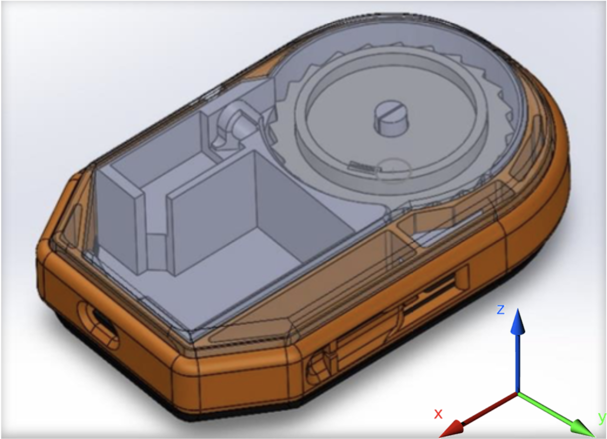
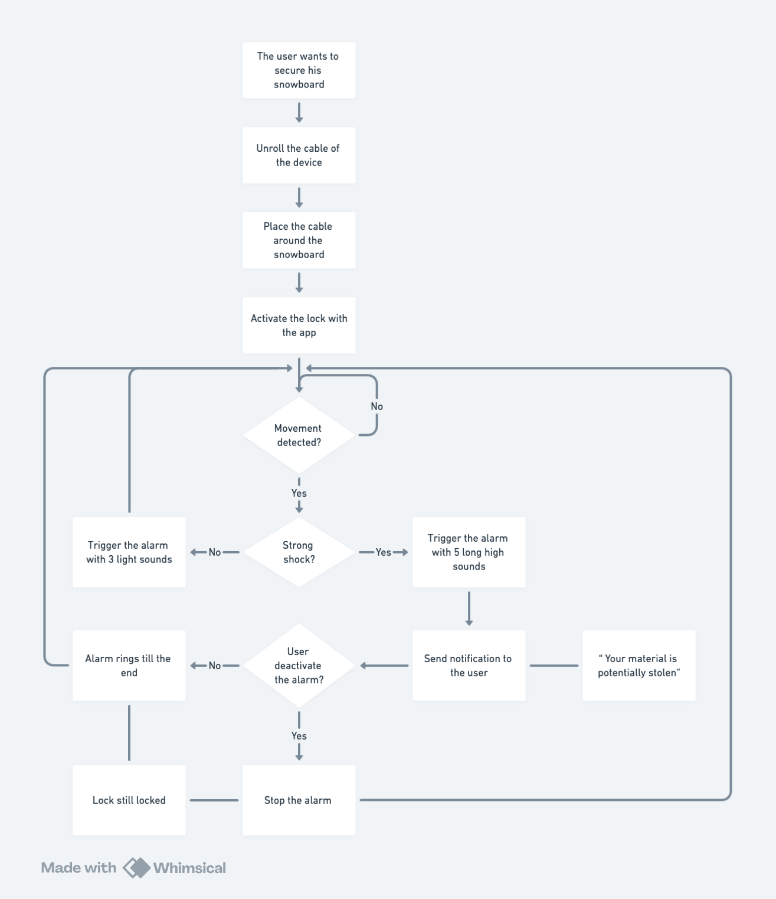
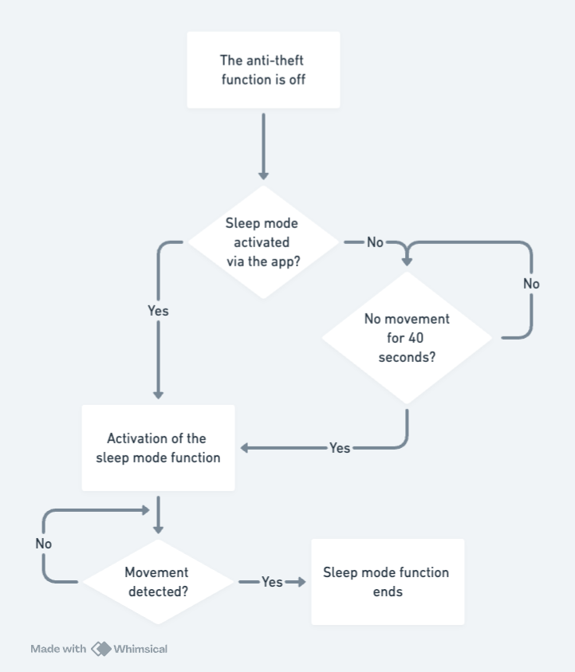

# <h1 align="center">Functional Specifications</h1>

created : 15/03/2024 last modified : 15/03/2024

Table Of Content

# 1 Introduction

## 1.1 Project Overview

We were asked to improve the embedded software of a prototype product. This product is a security device designed to secure sports equipment, this device is equipped with sensors to detect movement and is programmed to activate an alarm and notify the user on a smartphone application.

The software is currently developed in a C/C++ environment with added libraries meaning that we have to continue using this language to ensure that already implemented features will stay operational.

**The prototype's current features are:**

- Connection to the device via BLE
- Activate / Deactivate the anti-theft function via BLE
- Unlock the security cable via BLE
- Alarm
    - 3 light sounds when a small shock is detected
    - 5 long loud sounds when a big shock is detected
- Send movement notifications via a SIM card
- Send GPS position and Battery level every 15 minutes via a SIM card
- Sleep mode 
    - GPS functionalities are only powered when information should be sent
    - When the antitheft system is deactivated, and no movements are detected for 5 minutes, then the BLE function is disabled. As soon as a movement is detected, the BLE turns on again

**The features we were tasked with improving:**

- Battery Consomption Optimisation
    - Improve the energy efficiency of the system
    - Manage low battery situation
    - Increase the battery lifespan (keeping charge between 20% and 80%)
- Alarm Management & Simultaneous actions
    - Add the possibility to stop the alarm when it rings, even if the ringing cycle is not finished
    - Allow the alarm to be active while sending notification
    - Improve the management of interruptions
- Security
    - Increase the security level of the device to connect and access key features (activate/deactivate alarm & unlock cable)
- Device Management With NFC
    - Used to activate/deactivate the anti-theft system and unlock the cable via smartphone and SportShield app.

## 1.2 Project Definition

### 1.2.1 Vision

We are making improvements on the current prototype. We will upgrade the energy efficiency along with the security of the device and its connection capabilities.

### 1.2.2 Objectives

- Make improvements on the embedded software (add asked new features and upgrade current ones)
- Make improvements on the energy efficiency
- Use a C/C++ environment
- Keep the current features running

### 1.2.3 Scope

| In Scope |
| --- |
| Modify & Improve the embedded software |
| Create a User Manual |
| Use C/C++ |

| Out Of Scope |
| --- |
| Modify & Improve the smartphone application |
| Modify & Improve the hardware of the prototype |

### 1.2.4 Deliverables

| Name | Type | Deadline | Link |
| --- | --- | :-: | -: |
| Functional Specification | Document(Markdown) | 18/03/2024 | [functional-specification.md](./functional-specification.md) |
| Technical Specification | Document(Markdown) | 26/03/2024 | [technical-specification.md](./functional-specification.md) |
| Weekly Reports | Document(Markdown) | Every Friday | [weekly-reports/](./management/weekly-reports/) |
| Test Plan | Document(Markdown) | 10/04/2024 | [test-plan.md](./qa/test-plan.md) |
| User Manual | Document(PDF) | 10/04/2024 | [user-manual.pdf](./functional-specification.md) |
| Code Documentation | Document(PDF) | 10/04/2024 | [update.md](../update.md) |

## 1.3 Project Organisation

### 1.3.1 Project Representatives

| Project Owner | Represented by... |
| --- | --- |
| **ALGOSUP** | Franck Jeannin |
| Bistrel Tsangue | Arthur Lemoine (Program Manager) |

The project sponsors (represented in **bold**) are expected to be in charge of:
- Defining the vision and high-level objectives for the project.
- Approving the requirements, timetable, resources and budget (if necessary).
- Authorising the provision of funds/resources (internal or external) (if necessary).
- Approving the functional and technical specifications written by the team.
- Approving any major changes in scope.
- Receive Project Weekly Reports and take action accordingly to resolve issues escalated by the Project Manager.
- Providing final acceptance of the solution upon project completion.

### 1.3.2 Stakeholders

| Stakeholder | May Have/Find an Interest In |
| --- | --- |
| ALGOSUP | Have the students learn C/C++ programmation |
| ALGOSUP's Students | Learn C/C++ & get experience |

### 1.3.3 Project Roles

As defined by the project owner (ALGOSUP), the team is arranged as follows:

| Role | Description | Assigned Person |
| --- | --- | :-: |
| Project Manager | Is in charge of organization, planing and budgeting. Keep the team motivated. | Bistrel TSANGUE |
| Program Manager | Makes sure the project meets expectations.   Is in charge of design.   Is responsible for writing the Functional Specifications. | Arthur LEMOINE |
| Technical Lead | Makes the technical decision in the project. Translates the Functional Specification into Technical Specifications. Does code review. | Benoît DE KEYN |
| Software Engineer | Writes the code. Writes documentation. Participate in the technical design. | Aurélien FERNANDEZ |
| Quality Assurance | Tests all the functionalities of a product to find bugs and issues. Document bugs and issues. Write the test plan. Check that issues have been fixed. | Antoine PREVOST |
| Technical Writer | Makes the User Manual. | Clémentine CUREL |

### 1.3.4 Project Reviewers

External project reviewers have been appointed by the project owner to review our specifications and provide us with feedback.

## 1.4 Project Plan

### 1.4.1 Retroplanning

### 1.4.2 Milestones

| Milestone | Deadline |
| --- | --- |
| Functional Specifications V1 | Monday, March 18th 2024 |
| Technical Specifications V1 | Tuesday, March 26th 2024 |
| MVP (First Official Release) | Wednesday, Arpil 10th 2024 |
| Oral Presentation | Friday, April 19th 2024 |

### 1.4.3 Dependencies

The MVP requires some prior understanding of the technologies used before being developed, meaning that its development will probably start a bit later in the project.

The Oral Presentation depends on all the project and where we are at the end of deadlines.

The MVP requires the first version of the Technical Specifications to know how the project will be implemented.

The Technical Specifications require the first version of the Functional Specifications to know what will be implemented in the project.

These dependencies can be summarised as follows:

*Functional Specifications* **->** *Technical Specifications* **->** *MVP* **->** *Oral Presentation*

### 1.4.4 Resources

We have an estimated four hundred twenty (420) man-hours for this project

- Our team (6 people)
- 1 computer per team member
- Each team member's knowledge
- Teachers
- ALGOSUP's library

### 1.4.5 Constraints & Assumptions

| Constraints |
| --- |
| We have to code in C/C++ |
| We have to use Arduino's IDE (to write the program onto the embedded hardware) |
| We cannot render this project public outside of this GitHub repository and the school environment |

| Assumptions |
| --- |
| Arduino's IDE is reliable enough to not be a concern |
| Arduino's IDE will work on every computer configuration available in the team |
| The Hardware provided will work as intended without major or critical failure |

# 2 Functional Requirements

## 2.1 Features Overview

These are the features of the prototype as they are currently implemented.

### 2.1.1 Connection To The Device

User can connect their smartphone to the device via a BLE connection. This connection allows the user to Activate/Deactivate the Anti-theft functionality of the device and Unlock the security cable.

### 2.1.2 Anti-Theft function

The device's anti-theft function locks and tightens the security cable. Then every 15 minutes the device sends a notification to the user via a SIM card containing the GPS position of the device and its current battery level. Also, the device would detect any movement and activate the alarm along with sending a notification depending on the shock/movement detected.

### 2.1.3 Unlock Security Cable

This feature allows the user to unlock the security cable and retrieve their equipment (along with deactivating the anti-theft function).

### 2.1.7 Sleep Mode

When the anti-theft function isn't activated and the device doesn't detect any movement for 5 minutes, then the BLE is disabled to preserve the system's battery.

The device will get out of sleep mode if a movement is detected.

## 2.2 Features Breakdown

These are improvements we intend to bring to the client's prototype. 

### 2.2.1 Connection To The Device

#### 2.2.1.1 BLE

Users should be able to connect to the device via the application and its BLE capabilities. Users will be able to activate and deactivate the anti-theft function, unlock the security cable and enter sleep mode via this connection.

#### 2.2.1.2 NFC

Users should be able to connect to the device via the application and its NFC capabilities (The NFC connection should have the same capabilities as the BLE connection). It is however important to note that the NFC functionality is a nice-to-have feature, meaning that it isn't the most important want to implement and will be done if everything else has been already done.

### 2.2.2 Anti-Theft function

Once activated, this function will detect all shocks and movement, depending on which it will activate certain features to prevent theft. There are two types of shocks or movements which are small and big, the exact threshold at which a shock should be considered as noise, small or big will be defined after further testing to ensure the right match with real situations. The user will be able to activate or deactivate this function at will while they are connected to the device (either via BLE or NFC).

#### 2.2.2.1 Alarm

When a shock or movement is detected, depending on its type there are two outcomes:
- The shock or movement is a small one => an alarm of three (3) short beeps (two hundred (200) milliseconds of sound, two hundred (200) milliseconds of silence) will ring at 50% of the sound level capacity.
- The shock or movement is a big one => an alarm of five (5) long pips (three hundred fifty (350) milliseconds of sound, three hundred fifty (350) milliseconds of silence) will ring at 100% of the sound level capacity.

The software should be able to interrupt the alarm if needed (e.g. the alarm is ringing and the user wants to stop it as there are no thieves)

#### 2.2.2.2 Get GPS Position

When a big shock or movement is detected, the software should get the GPS position of the device. 

The GPS of the device will also be requested to be sent in regular notification when the anti-theft function is activated.

This feature needs to be activated only when necessary to avoid unnecessary battery consumption.

#### 2.2.2.3 Send Notification

When the anti-theft function is activated, the software should send a notification every fifteen (15) minutes to the user containing the GPS position and the battery level of the device.

When a strong shock or movement is detected, the software should send a notification to the user (e.g. "Your Equipment Is Currently Being Stolen") with the GPS position of the device.

### 2.2.3 Unlock Security Cable

the software should be able to unlock the security cable when the user requests it (via the application).

### 2.2.4 Sleep Mode

When the anti-theft function is deactivated, and the device hasn't detected any movement for 40 seconds, the BLE will be turned off to save energy. It will be activated again if a rotation of 180° on the x-axis is detected. (Schematics for reference bellow)

### 2.2.5 Simultaneous Action

The software should be capable of executing multiple actions at the same time (e.g. ringing the alarm while getting GPS position and sending a notification to the user).

## 2.3 Personae Definition

### Proffessional skier - Sam  
Goals:
- Ensure nobody touches his skis at a competition to ensure they are not sabotaged to hinder his worldwide success.
- Having a long-lasting battery lock which would limit the time his skis are not protected.

Challenges:

- Ensuring a faithful recognition of shocks triggering a notification to Sam's mobile.
- Alarm triggering sufficiently loud to catch people's attention on the skis.

### Vacationer - Juan  
Goals:
- Protect his skis while eating at a restaurant.
- Have access to the location of his skis at any time. 

Challenges:

- Avoid disturbance to surrounding people with the option to activate sleep mode from the app.
- Limit battery consumption while sending location information.

### Ski instructor - Joe  
Goals:
- Protect his skis between two ski lessons even in a cold environment.
- Unlock the skis even if he has no battery on his phone.  

Challenges:

- Manage low battery situation while increasing battery lifespan.
- Add a reliable NFC detector to detect the phone's NFC system.

## 2.4 Use Cases Analysis

| Use Case Number | Name | Description | Pre-Conditions | Flow of Events | Post Conditions | Exit Criteria |
| --- | --- | --- | --- | --- | --- | --- |
| 1 | Secure Sports Equipment | The device will secure the equipment | The device is connected to the application | The user activates the anti-theft function and locks the security cable around the equipment they want to be secured | - The security cable is locked - the anti-theft function is activated | The anti-theft function is deactivated |
| 2 | Retrieve Sports equipment | The device will unlock the security cable |- The device is connected to the application - The device's anti-theft function is activated | The user deactivates the anti-theft function on the application, the device unlocks the security cable | - The security cable is unlocked - The anti-theft function is deactivated | - The anti-theft function is activated  - The device goes into sleep mode |
| 3 | Alert When theft | When someone tries to steal the equipment | The device's anti-theft function is activated | Someone tries to steal the equipment, the device rings its alarm and notifies the user | - The device's alarm is on - The user has received a notification on the application | The anti-theft function is deactivated |
| 4 | Sleep Mode | When not used, the device goes into sleep mode | - The anti-theft function is deactivated - No movement has been detect for 40 seconds  - The user activate sleep mode via the application | The device deactivate its BLE and NFC functions | The device's BLE and NFC is deactivated | The device is rotated 180° on the x-axis |

## 2.5 Flow Charts

# 3 Non-Functional Requirements

## 3.1 Reliability

The software should be able to secure and release the sports equipment when needed and should be able to recover from crashes and failures.

## 3.4 Operability

The software should run on the hardware provided by the client.

## 3.5 Recovery

The software should keep the cable locked in case of critical failure and then recover to ensure security.

## 3.7 Maintainability

To ensure that the software is and will be maintainable in the future, our code should be heavily commented on and documented.

## 3.8 Security

In terms of security, we need to ensure that the device cannot be accessed by unwanted users (such as thieves) either via BLE or by NFC connection. We also need to ensure that the software is capable of recovering from failures and crashes.

# 4 Glossary

| Term / Acronym | Definition |
| --- | --- |
| BLE | Acronym for Bluetooth, a wireless connection between electronic devices. |
| NFC | Acronym for Near-Field Communication which allows communication between two electronic devices over a distance of 4 centimetres (1.6 in) or less. |
| IDE | Acronym for Integrated Development Environment which is an application that helps programmers develop software. | 