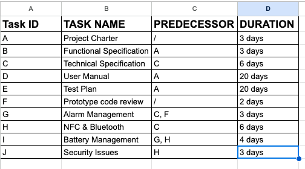
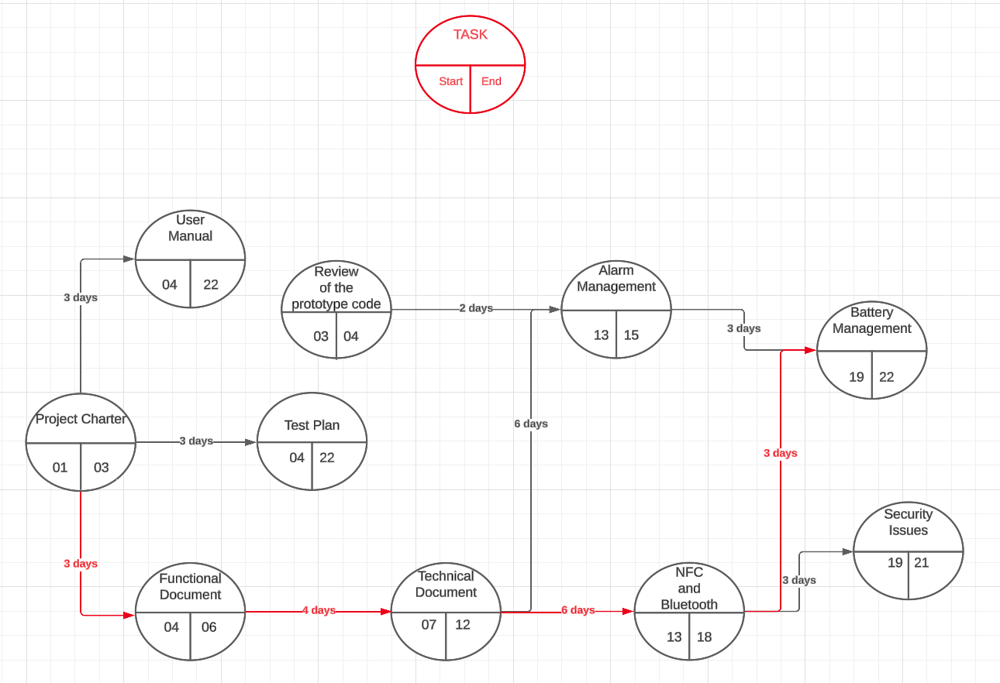

<h1 align="center"> Team 5 SPORTSHIELD Critical Path Method</h1>

## Definition

The critical path method is a technique that helps us to identify tasks that are necessary for project completion. The critical path in project management is the longest sequence of activities that must be finished on time to complete the entire project. In case there is a delay in one of those task, this will cause a subsequent delay in the overall project completion

The image below shows a table of dependent tasks and independent tasks needed to draw and establish the critical path.

### TASK ID:
This is the unique identification of a particular task. It is essential to identify the pattern of dependent and independent tasks.

### TASK NAME:
This is the name of the task.

### PREDECESSOR:
Here, we assign the TASK ID to different tasks that require a particular task to be completed before they can start executing. A dash is used to represent tasks that don't depend on any other tasks before starting.

### DURATION:
Here, we determine the estimated duration of each task.

## Critical Path Scheme:

In the image provided above, you will see a red line which represents the critical path of the project.

Please note that the numbers shown on the red line do not represent the number of days we should wait for a task to start after the previous task is completed. Rather, these numbers represent the number of days that the previous task required to get finished.

To calculate the critical path, we follow these steps:
1. We identify the longest path of dependent activities from the beginning of the project to the end.
2. We mark this path to differentiate it from other tasks.
3. We then add up the number of days required for each task marked differently as per step 2.

Therefore, the critical path for the project is calculated as follows:
3 + 4 + 6 + 6 = 19 days

This means that if there is a delay in any of the tasks on the critical path, even by just one day, it will have an impact on the entire project.

