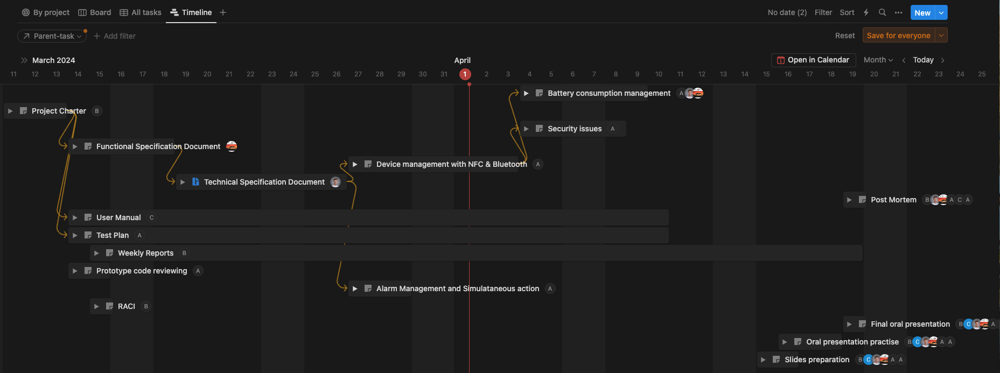

<h1 align="center"> Team 5 SPORTSHIELD GANTT CHART</h1>

## What is a Gantt chart?

A Gantt chart is a popular project management tool used to visually represent the scheduling of tasks over time. It displays a timeline along the horizontal axis, usually divided into days, weeks, or months, and a list of tasks or activities along the vertical axis.

Each task is represented by a horizontal bar on the chart, with its length indicating the duration of the task and its position indicating when it is scheduled to start and finish. Dependencies between tasks can also be shown, indicating which tasks must be completed before others can begin.

- The image below will illustrate all the activities that must be fullfilled in order to complete the project.

