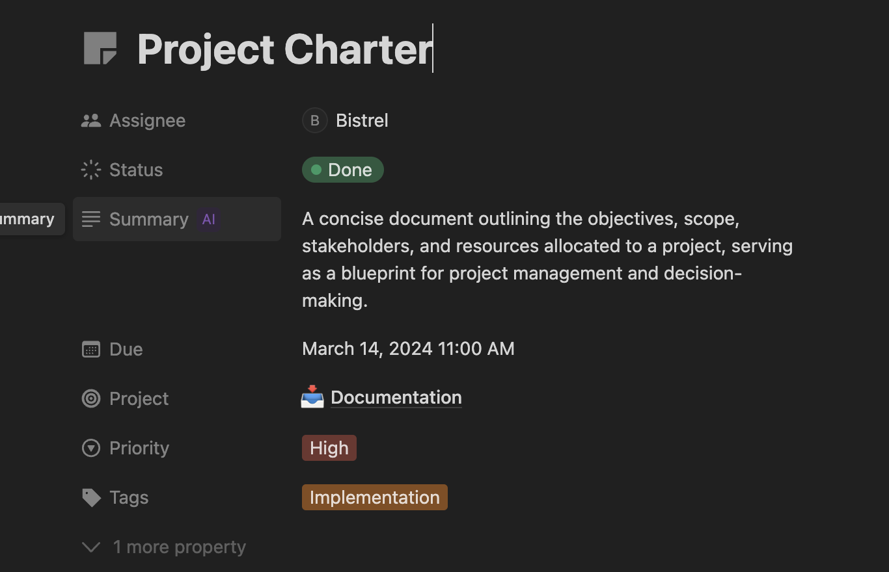
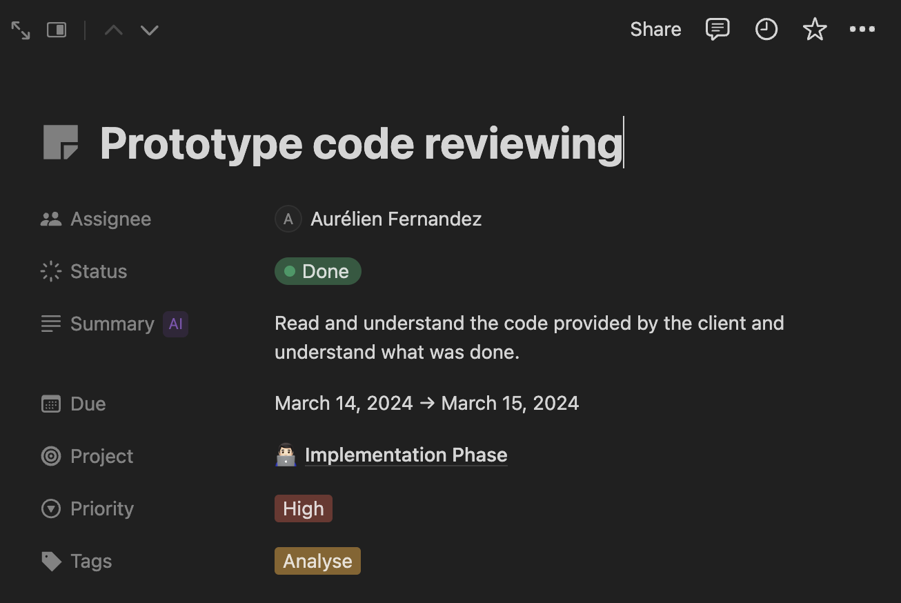
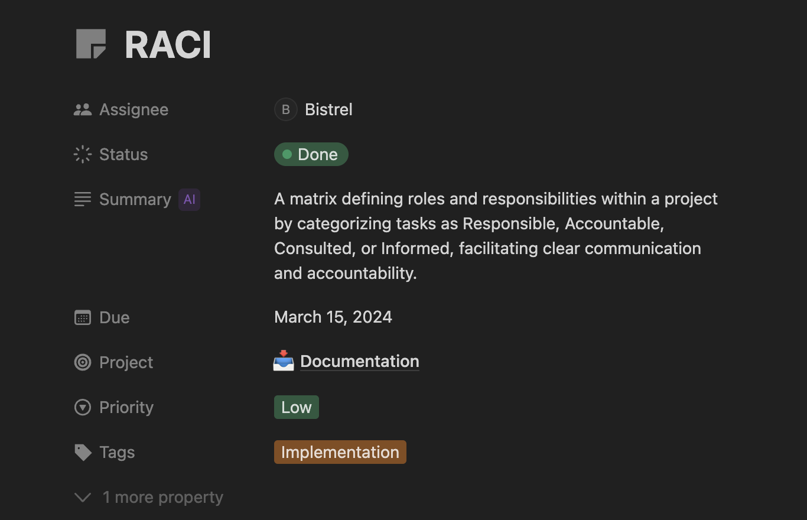
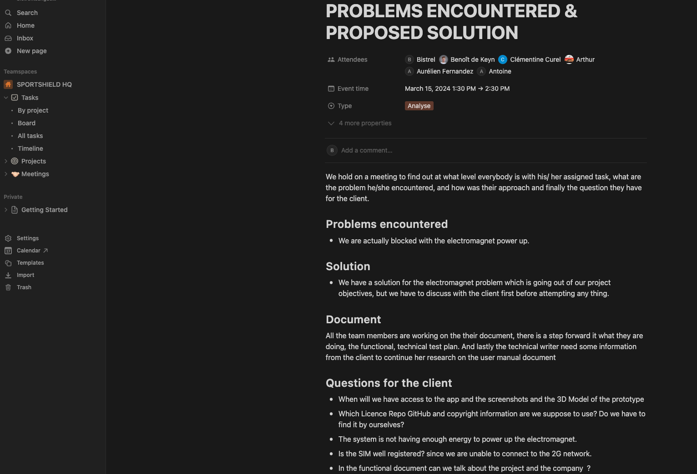
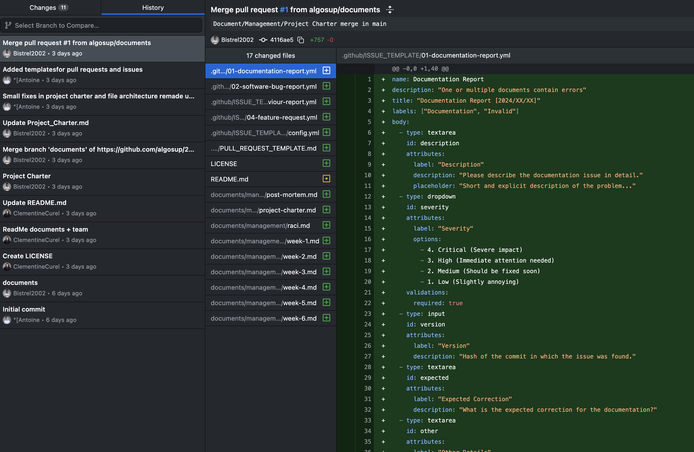
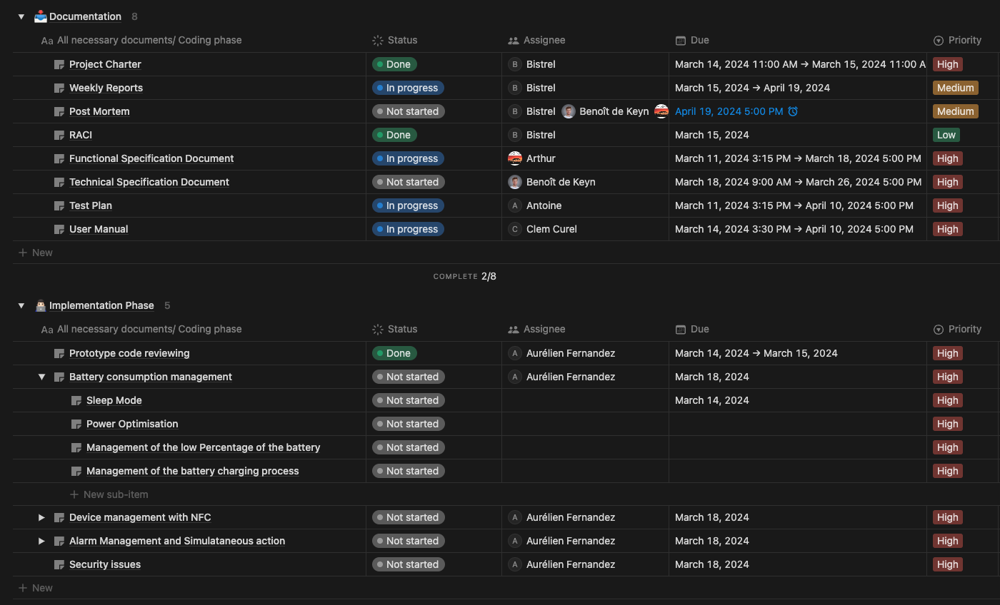
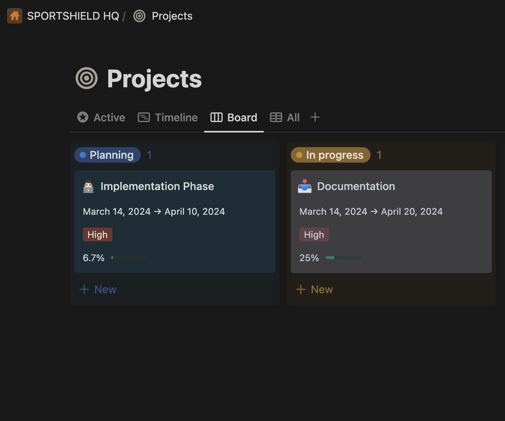

# Weekly Report - Week 1

<b>Table of Contents</b>

1. [Overview](#overview)
2. [Goals](#goals)
3. [Challenges](#challenges)
4. [Key Accomplishments](#key-accomplishments)
5. [Upcoming Week](#upcoming-week)
6. [Meetings and Collaborations](#meetings-and-collaborations)
7. [Metrics and KPIs](#metrics-and-kpis)
8. [Other Notes](#other-notes)

------------
## Overview

The week started with CORIS INNOVATION presenting to us their sportshield prototype innovative idea, followed by the improvement they want us to do on the project, and the expected outcomes they wish to have at the end of the project. We started analyzing the hardware product by focusing on studying and understanding the prototype CORIS INNOVATION gave to us, thoroughly understanding the documents detailing each piece of the hardware and how it functions.

## Goals

- Reading and understanding the prototype document, so as to clearly understand at what level they are and what we have to do.
- Learn c++.
- Understanding the prototype code written in c++.
- Start with functional, project charter, RACI documents
- Research on how to create the User Manual document.
- Creating a template for github pull request, and for github issue

## Challenges
1. The alarm buzzer enters an infinite loop each time a harsh movement is detected, causing the alarm to continuously ring. The buzzer loop condition is always and only true when a harsh movement is detected.
2. After several analyses made on the hardware, we discovered some problems:
    - Firstly, with the electromagnet; the battery is not supplying enough energy to power the electromagnet.
    - Secondly, the SIM card isn't detecting the 2G connection.

## Key Accomplishments
- The problem with the alarm buzzer has been resolved.
- All the templates have been created(github pull request and github issue).
- The project charter has been completed.

- The project hardware document has been completed read and understood from scratch by half of the team members.
- Understanding the initial prototype code.

- We find a way to aliment the electromagnet, but it need to be approved first by the client before we start doing anything.
- The RACI document was completed

## Upcoming Week

- Continue with the hardware analysis, to find out some potential mistake that may altered the desired outcome of the client.
- Keep on learning C++ for better understanding and handling the code.
- Complete the technical specification document.
- Submit the functional specification document.
- Complete the RACI.
- Start the implementation of different problems we are suppose to resolve and the improvements we have to make.

## Meetings and Collaborations

 A meeting was held on 15/03/2024 at 1:30 PM and ended at 2:30 PM, during which we noted some important points and gathered some questions to ask the client. The image under clearly outline some key points noted during the meeting.

## Metrics and KPIs

1. **Code Metrics:**
The image unders shows all the commit and push that have been done within the week. and global information on what have been done.

2. **Project management metrics:**

The image below displays various information on each task; the starting and ending date, the priority of each tasks, completed tasks, tasks in progress, and finally tasks that haven't yet started, this information allows us to know how far we are from the final product and at what rate we are supposed to work so as to not meet the deadline(Commits Titles).

## Other Notes

Week1 work percentage.

The week started very well and we manage to understand the the provided information from the client, and this is a big step to start next week in deep work.

