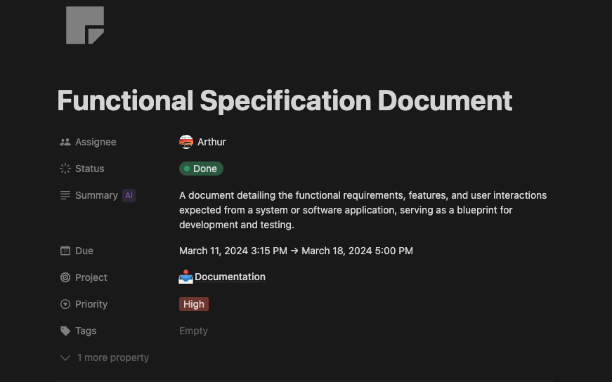
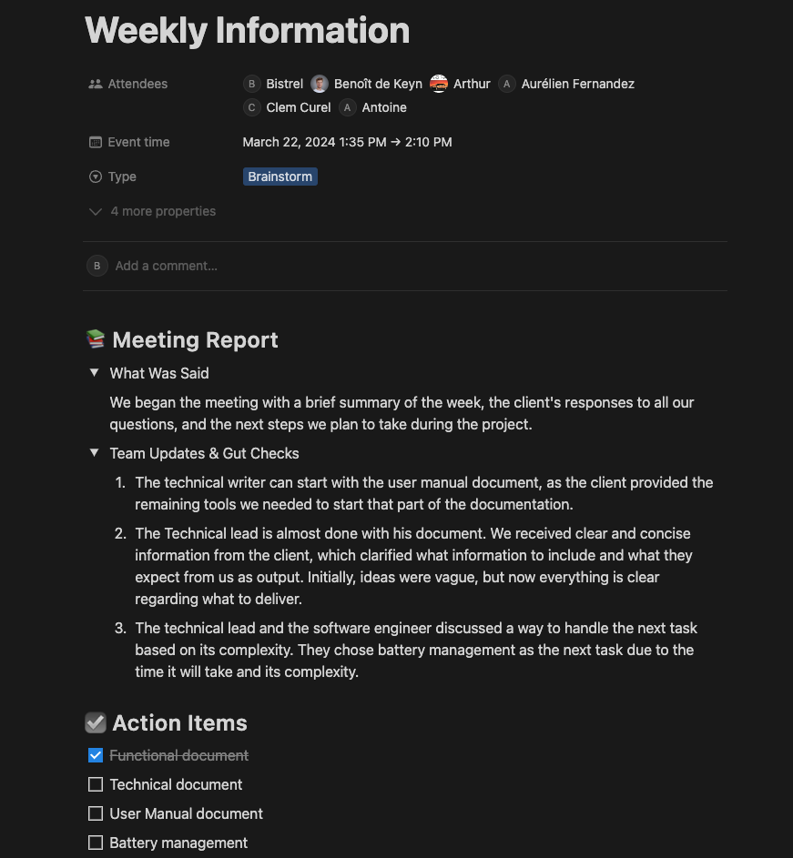
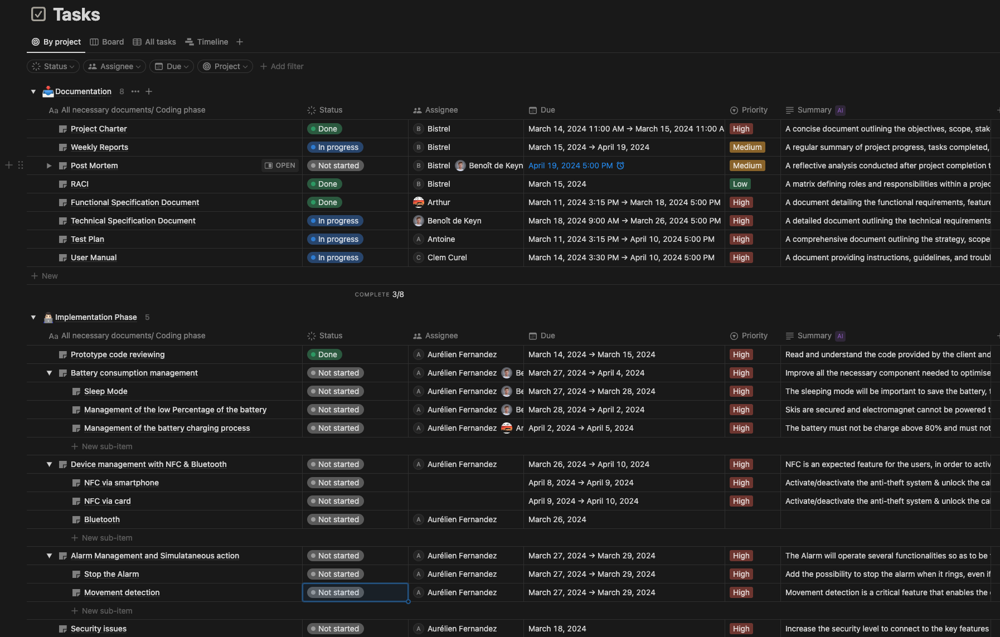
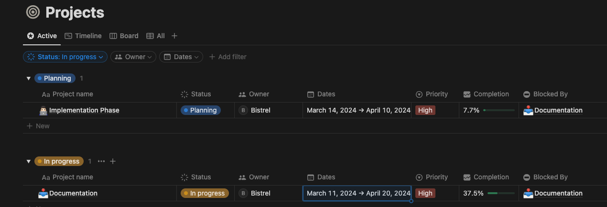

# Weekly Report - Week 2

<b>Table of Contents</b>

1. [Overview](#overview)
2. [Goals](#goals)
3. [Challenges](#challenges)
4. [Key Accomplishments](#key-accomplishments)
5. [Upcoming Week](#upcoming-week)
6. [Meetings and Collaborations](#meetings-and-collaborations)
7. [Metrics and KPIs](#metrics-and-kpis)
8. [Other Notes](#other-notes)

------------
## Overview

The week started off normally in our project rooms, with the main objectives being to complete the functional phase and commence the implementation phase of the project.

## Goals

1. Deliver the Functional Specification document.
2. Begin work on the Technical Specification document.
3. Ask questions to the client to gain a clear and concise understanding of their expectations for the final product and what they require from us.

## Challenges

## Key Accomplishments

1. The functional specification document was delivered at time

2. We got a respond from the client, and we finally understood what the client actually need from us

## Upcoming Week

1. We planned to start with the implementation phase of the battery(optimizing the battery to be more precise"Reduce the battery consumption").
2. Start with the improvements that are suppose to be done on the Alarm.
2. Complete the technical specification document.
3. Keep working as usual
4. Continue with learning phase of the c++ programming language

## Meetings and Collaborations

We held a meeting to review the progress of each team member and identify any areas where they encountered obstacles or challenges. We discussed the key points they considered in order to succeed and their planned approach to finding solutions.

The image below summarize key points noted during the meeting

## Metrics and KPIs

1. **Project management metrics:**
The images below will show the progression level of the project in the documentation phase and in the coding phase.
- Individual tasks.

- Overall project percentage

## Other Notes

The week was full of challenges but we are moving slowly and learning new things as days are moving.
