<h1 align="center"> Team 5 SPORTSHIELD Cumulative Weekly Reports </h1>

Fast access to weekly reports

- [WEEK 1](week-1)

- [WEEK 2](week-2)

- [WEEK 3](week-3)

- [WEEK 4](week-4)

- [WEEK 5](week-5)

- [WEEK 6](week-6)

# WEEK 1
[Original Document](https://github.com/algosup/2023-2024-project-4-sportshield-team-5/blob/4694e76bd2befe8af7a87f23bf6c58e64aa6f18f/documents/management/weekly-reports/week-1.md)

## Overview

The week started with a COMPANY presenting to us their sportshield prototype innovative idea, followed by the improvement they want us to do on the project, and the expected outcomes they wish to have at the end of the project. We started analyzing the hardware product by focusing on studying and understanding the prototype COMPANY gave to us, thoroughly understanding the documents detailing each piece of the hardware and how it functions.

## Goals

- Reading and understanding the prototype document, so as to clearly understand at what level they are and what we have to do.
- Learn c++.
- Understanding the prototype code written in c++.
- Start with functional, project charter, RACI documents
- Research on how to create the User Manual document.
- Creating a template for github pull request, and for github issue

## Challenges
1. The alarm buzzer enters an infinite loop each time a harsh movement is detected, causing the alarm to continuously ring. The buzzer loop condition is always and only true when a harsh movement is detected.
2. After several analyses made on the hardware, we discovered some problems:
    - Firstly, with the electromagnet; the battery is not supplying enough energy to power the electromagnet.
    - Secondly, the SIM card isn't detecting the 2G connection.

## Key Accomplishments
- The problem with the alarm buzzer has been resolved.
- All the templates have been created(github pull request and github issue).
- The project charter has been completed.
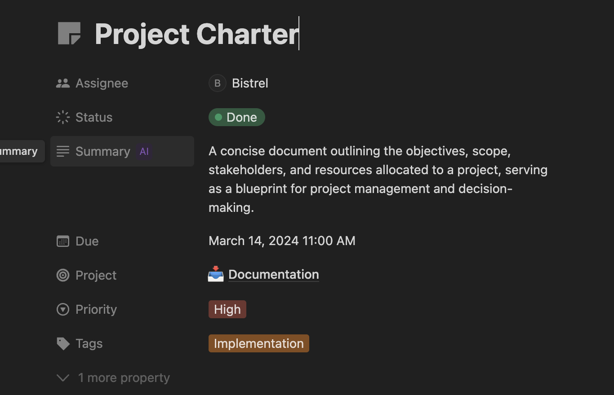
- The project hardware document has been completed read and understood from scratch by half of the team members.
- Understanding the initial prototype code.
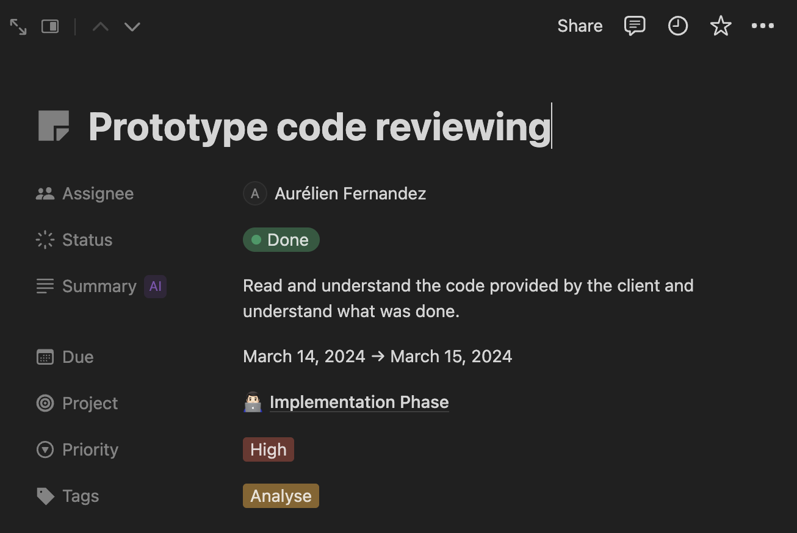
- We find a way to aliment the electromagnet, but it need to be approved first by the client before we start doing anything.
- The RACI document was completed
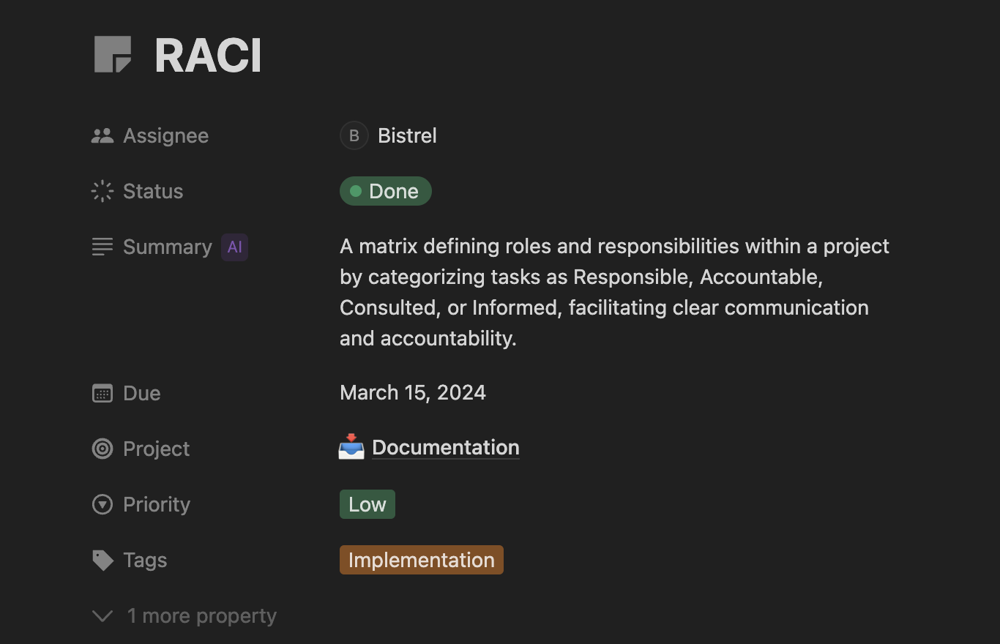

## Upcoming Week

- Continue with the hardware analysis, to find out some potential mistake that may altered the desired outcome of the client.
- Keep on learning C++ for better understanding and handling the code.
- Complete the technical specification document.
- Submit the functional specification document.
- Complete the RACI.
- Start the implementation of different problems we are suppose to resolve and the improvements we have to make.

## Meetings and Collaborations

 A meeting was held on 15/03/2024 at 1:30 PM and ended at 2:30 PM, during which we noted some important points and gathered some questions to ask the client. The image under clearly outline some key points noted during the meeting.

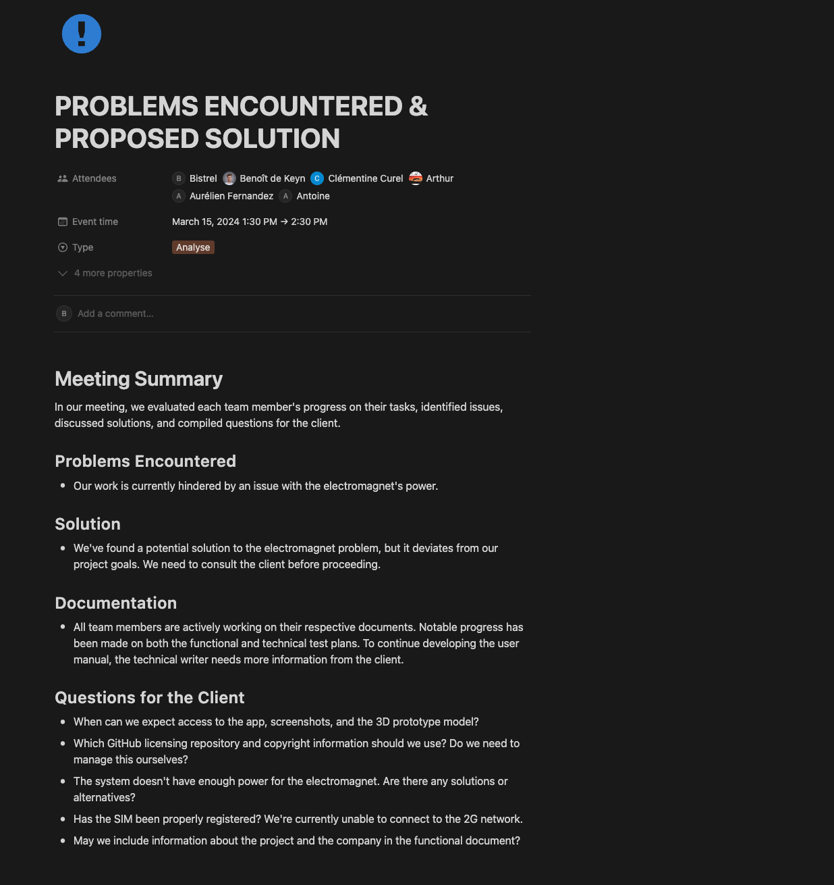

## Metrics and KPIs

1. **Code Metrics:**
The image under shows all the commit and push that have been done within the week. and global information on what have been done.

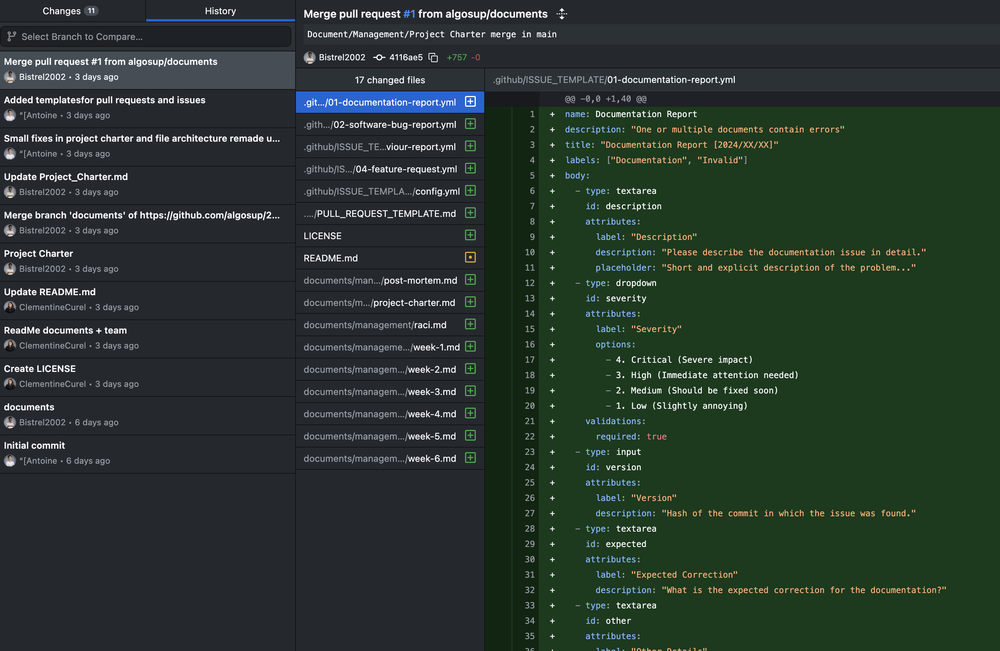

2. **Project management metrics:**

The image below displays various information on each task; the starting and ending date, the priority of each tasks, completed tasks, tasks in progress, and finally tasks that haven't yet started, this information allows us to know how far we are from the final product and at what rate we are supposed to work so as to not meet the deadline(Commits Titles).

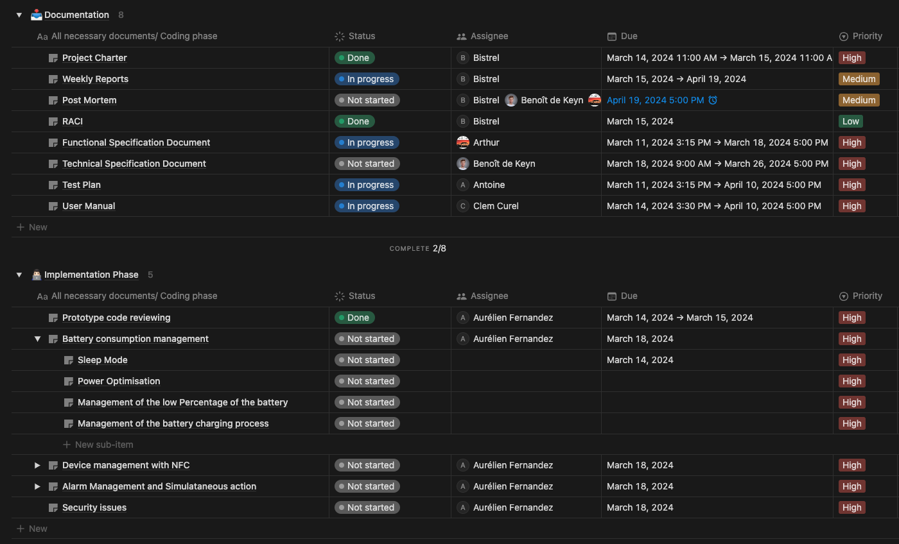

## Other Notes

Week1 work percentage.
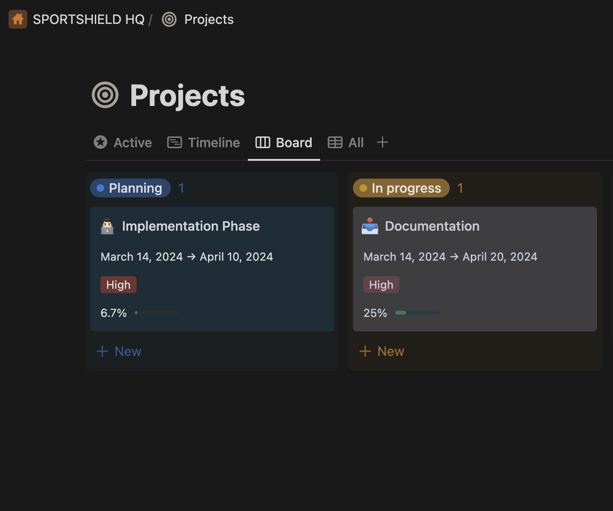

The week started very well and we manage to understand the the provided information from the client, and this is a big step to start next week in deep work.

# WEEK 2

[Original Document](https://github.com/algosup/2023-2024-project-4-sportshield-team-5/blob/4694e76bd2befe8af7a87f23bf6c58e64aa6f18f/documents/management/weekly-reports/week-2.md)

## Overview

The week started off normally in our project rooms, with the main objectives being to complete the functional phase and commence the implementation phase of the project.

## Goals

1. Deliver the Functional Specification document.
2. Begin work on the Technical Specification document.
3. Ask questions to the client to gain a clear and concise understanding of their expectations for the final product and what they require from us.

## Challenges

## Key Accomplishments

1. The functional specification document was delivered at time
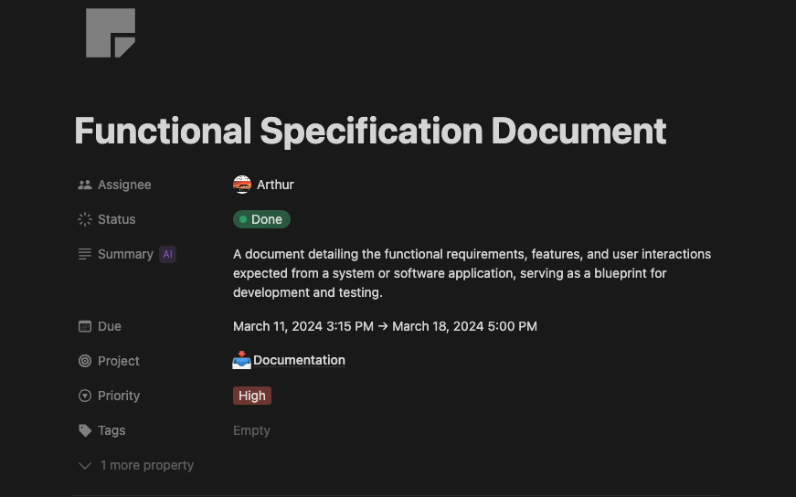
2. We got a respond from the client, and we finally understood what the client actually need from us

## Upcoming Week

1. We planned to start with the implementation phase of the battery(optimizing the battery to be more precise"Reduce the battery consumption").
2. Start with the improvements that are suppose to be done on the Alarm.
2. Complete the technical specification document.
3. Keep working as usual
4. Continue with learning phase of the c++ programming language

## Meetings and Collaborations

We held a meeting to review the progress of each team member and identify any areas where they encountered obstacles or challenges. We discussed the key points they considered in order to succeed and their planned approach to finding solutions.

The image below summarize key points noted during the meeting
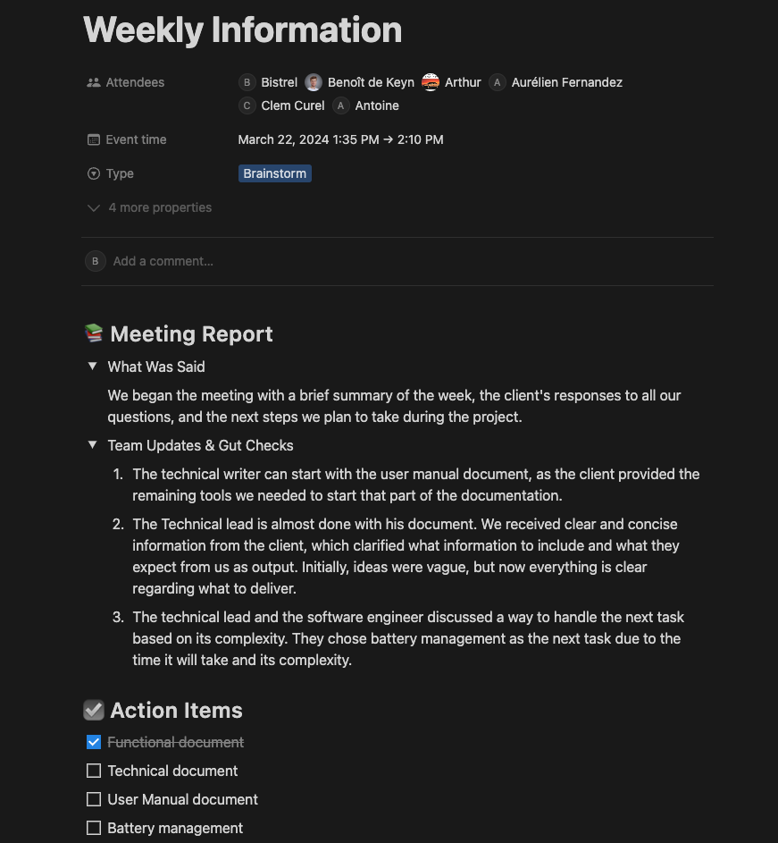

## Metrics and KPIs

1. **Project management metrics:**
The images below will show the progression level of the project in the documentation phase and in the coding phase.
- Individual tasks.

- Overall project percentage
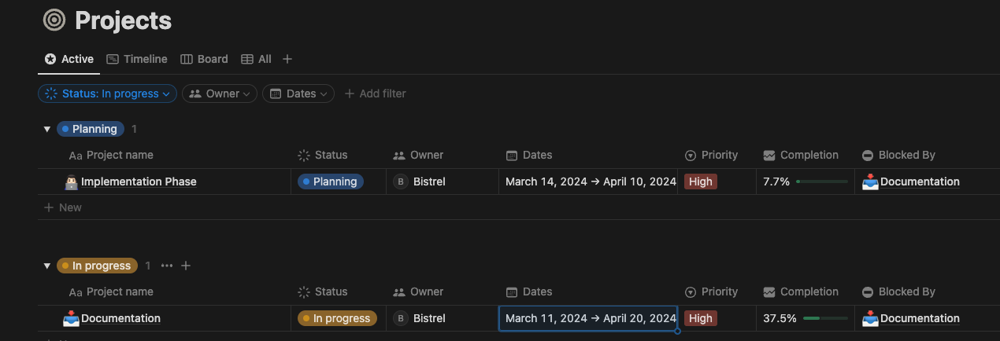

## Other Notes

The week was full of challenges but we are moving slowly and learning new things as days are moving.

# WEEK 3
[Original Document](https://github.com/algosup/2023-2024-project-4-sportshield-team-5/blob/4694e76bd2befe8af7a87f23bf6c58e64aa6f18f/documents/management/weekly-reports/week-3.md)

------------
## Overview
We started the week with our main goal trying to complete as many tasks as possible on the implementation phase and deliver the technical document.

## Goals

- Implement the bluetooth
- Complete with the improvement of the alarm
- Complete and deliver the technical document
- Start implementing the device management with NFC

## Key Accomplishments

- Bluetooth implementation
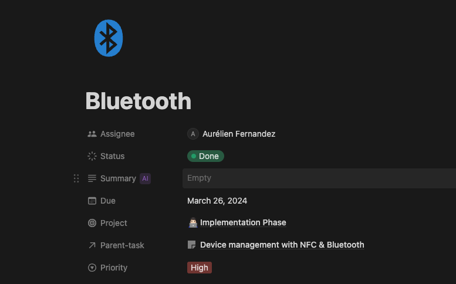
- Technical document delivery
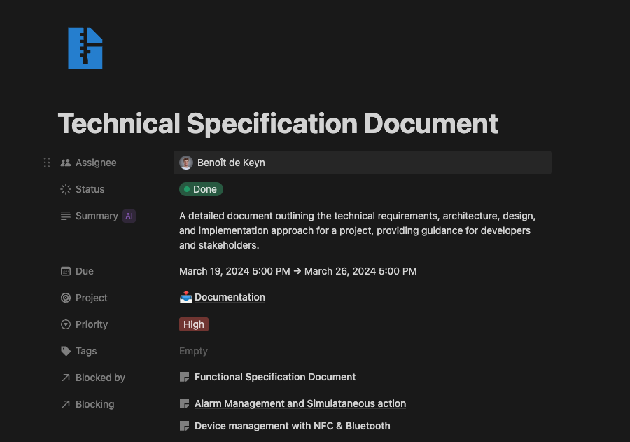
- Improvement of the alarm.
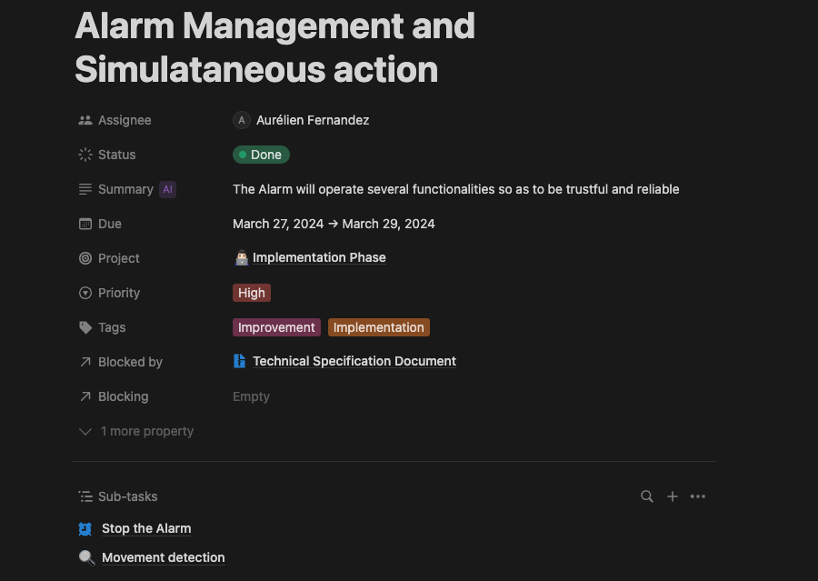

## Upcoming Week

- Continue with the coding phase
- Continue with the user manual document
- Complete the device management with NFC

## Metrics and KPIs

1. **Project management metrics:**
The images below will show the progression level of the project in the documentation phase and in the coding phase.
- Individual tasks.
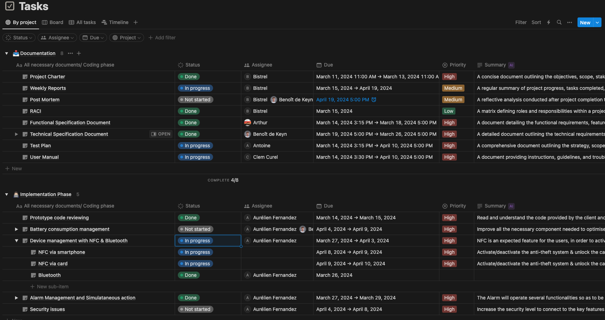

- Project progression percentage
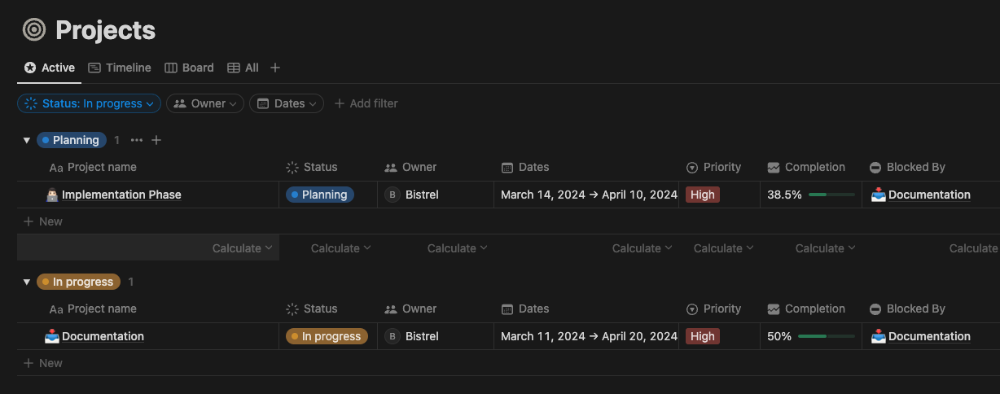

## Other Notes

- We made significant progress on the coding phase this week and have a clear plan to finish the project before the deadline.

# WEEK 4

[Original Document](https://github.com/algosup/2023-2024-project-4-sportshield-team-5/blob/cad6adad2e0df4171eab92c59208b302e8bca699/documents/management/weekly-reports/week-4.md)

# WEEK 5

[Original Document](https://github.com/algosup/2023-2024-project-4-sportshield-team-5/blob/cad6adad2e0df4171eab92c59208b302e8bca699/documents/management/weekly-reports/week-5.md)

# WEEK 6

[Original Document](https://github.com/algosup/2023-2024-project-4-sportshield-team-5/blob/cad6adad2e0df4171eab92c59208b302e8bca699/documents/management/weekly-reports/week-6.md)

