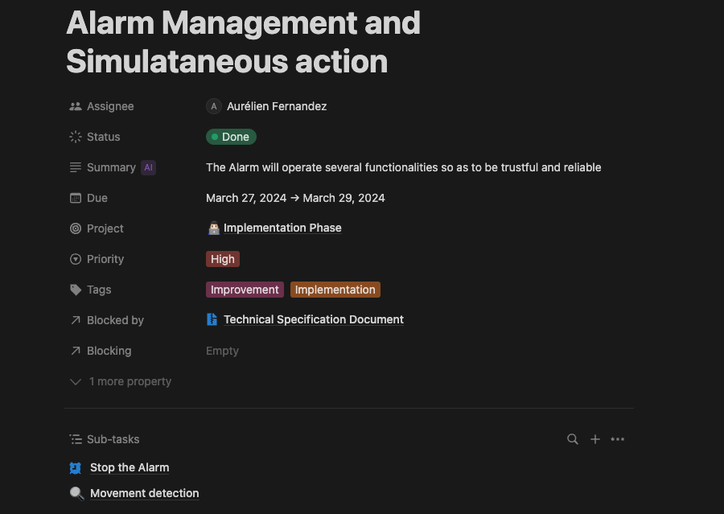
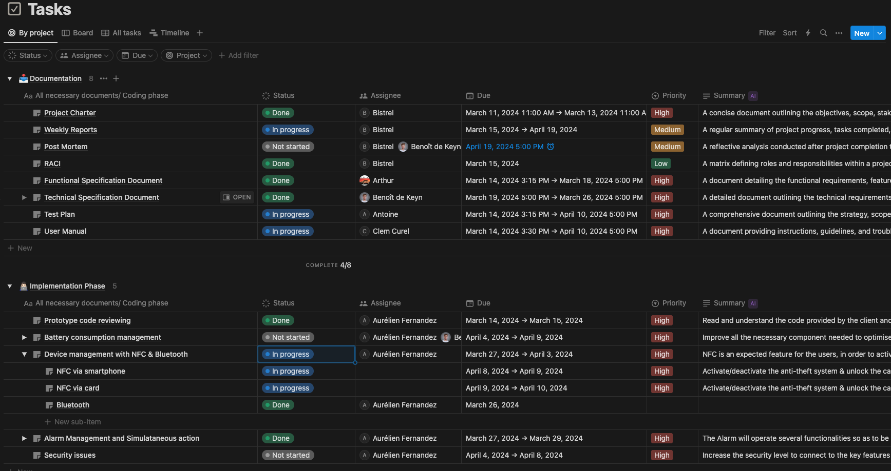

# Weekly Report - Week 3

<b>Table of Contents</b>

1. [Overview](#overview)
2. [Goals](#goals)
3. [Key Accomplishments](#key-accomplishments)
4. [Upcoming Week](#upcoming-week)
5. [Meetings and Collaborations](#meetings-and-collaborations)
6. [Metrics and KPIs](#metrics-and-kpis)
7. [Other Notes](#other-notes)

------------
## Overview
We started the week with our main goal trying to complete as many tasks as possible on the implementation phase and deliver the technical document.

## Goals

- Implement the bluetooth
- Complete with the improvement of the alarm
- Complete and deliver the technical document
- Start implementing the device management with NFC

## Key Accomplishments

- Bluetooth implementation

- Technical document delivery

- Improvement of the alarm.

## Upcoming Week

- Continue with the coding phase
- Continue with the user manual document
- Complete the device management with NFC

## Metrics and KPIs

1. **Project management metrics:**
The images below will show the progression level of the project in the documentation phase and in the coding phase.
- Individual tasks.

- Project progression percentage

## Other Notes

- We made significant progress on the coding phase this week and have a clear plan to finish the project before the deadline.