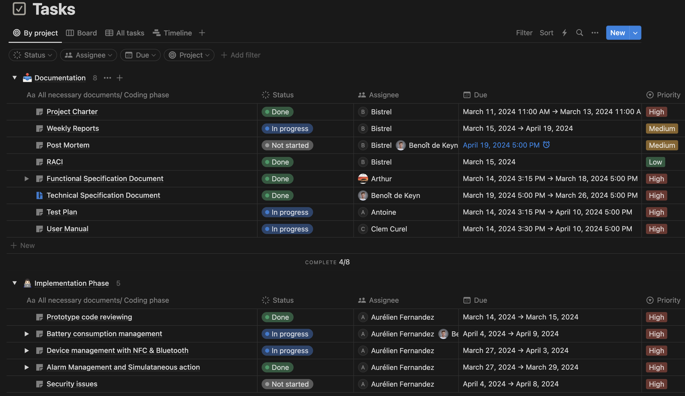
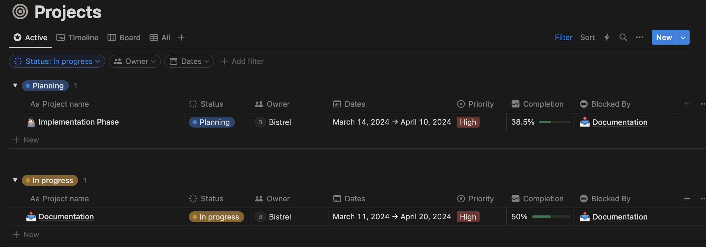

# Weekly Report - Week 4

<b>Table of Contents</b>

1. [Overview](#overview)
2. [Goals](#goals)
3. [Challenges](#challenges)
5. [Upcoming Week](#upcoming-week)
7. [Metrics and KPIs](#metrics-and-kpis)
8. [Other Notes](#other-notes)

------------
## Overview

We started the week with almost only one day project, quite challenging for, us since we were left with just a 2 days project.

## Goals

- Battery management.
- Complete with the coding phase of the NFC.

## Challenges

- It's proving to be extremely difficult to finish the remaining tasks within the given project timeline.

## Upcoming Week

- Complete with the coding phase of the NFC.
- Complete with battery management.

## Metrics and KPIs

- **All Tasks**

- **Progrssion level**

## Other Notes

The week was not full of project time, and we are a little behind schedule. However, we will catch up this week and do better.