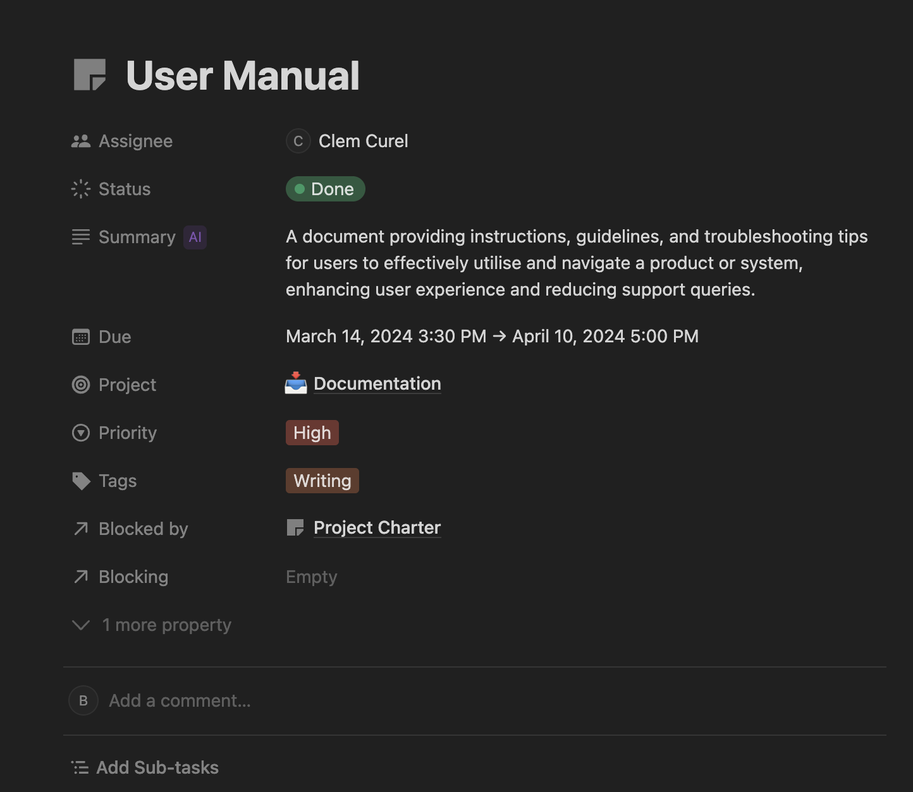
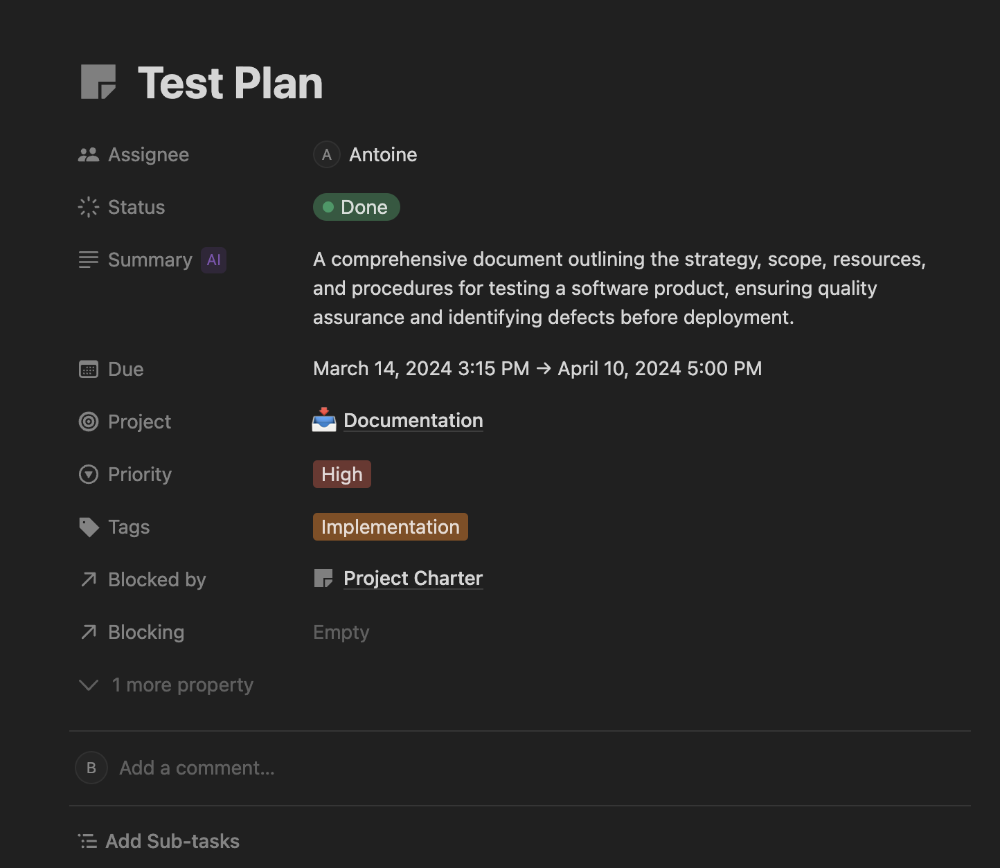
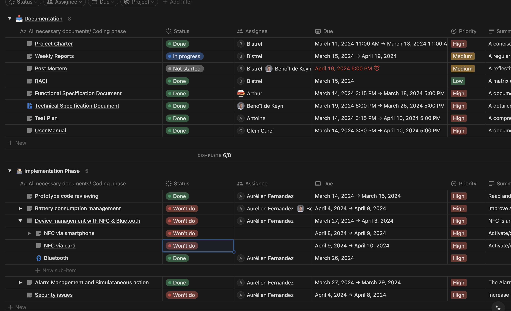
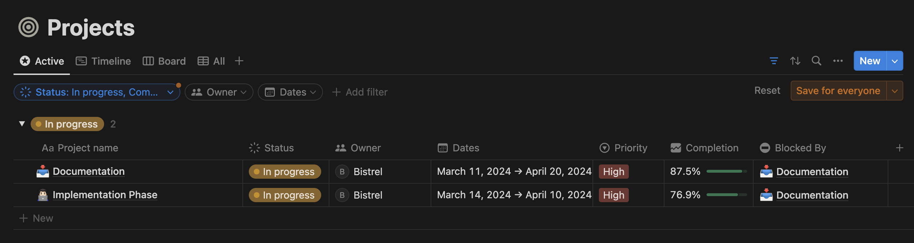

# Weekly Report - Week 5

<b>Table of Contents</b>

1. [Overview](#overview)
2. [Goals](#goals)
3. [Challenges](#challenges)
4. [Key Accomplishments](#key-accomplishments)
5. [Upcoming Week](#upcoming-week)
7. [Metrics and KPIs](#metrics-and-kpis)
8. [Other Notes](#other-notes)

------------
## Overview
We were almost meeting the project deadline, but unfortunately, we didn't have enough time to complete the project.

## Goals

- Complete the the NFC
- Complete the user manual document
- Complete the test plan document

## Challenges

We saw that the NFC was a big challenge so we didn't manage to implement it.

## Key Accomplishments

- User manual document.

- Test plan document.

## Upcoming Week

- Start preparing for the final Oral presentation.

## Metrics and KPIs

- **All Tasks**

- **Progrssion level**

## Other Notes

We finished with the implementation phase of the project even though we did not implement everything. Our next focus is preparing for the final oral presentation.