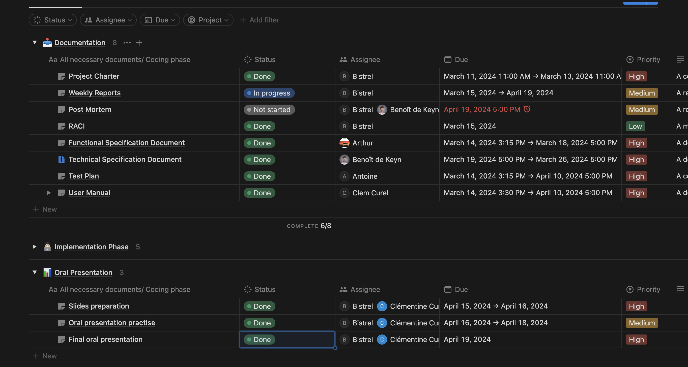
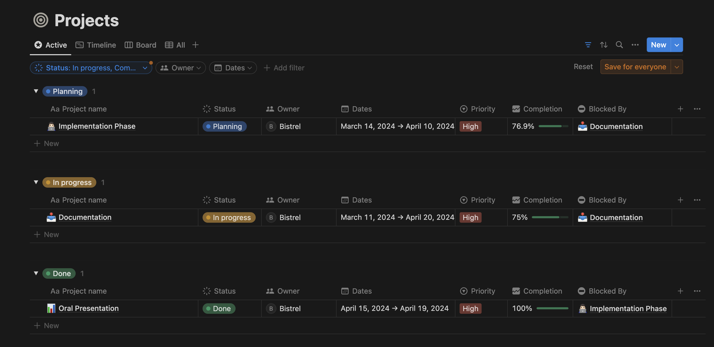

# Weekly Report - Week 6

<b>Table of Contents</b>

1. [Overview](#overview)
2. [Goals](#goals)
4. [Key Accomplishments](#key-accomplishments)
5. [Metrics and KPIs](#metrics-and-kpis)
6. [Other Notes](#other-notes)

------------
## Overview

This week we focus on working on our canvas presentation, rehearsing what we have to say in front of the juries, and finally presenting our product.

## Goals
- Preparing all the slides for the presentation.
- Practice for the final oral presentation.
- Present the final product in front of the juries.

## Key Accomplishments
- Slides preparation.
- Oral presentation practice.
- Final oral presentation.

## Metrics and KPIs

- **All Tasks**

- **Progrssion level**

## Other Notes

We did the final Oral presentation, we were glad to work on this project. It was a good experience as some of us learned some new skills.
