# Technical Specification
 ALGOSUP - Team 5 - Project n°4 - SportShield

  
    

| Role | Name |
|---|---|
| Project Manager | Vivien TSANGUE |
| Program Manager | Arthur LEMOINE |
| Tech Lead | Benoît DE KEYN |
| Software Developer | Aurélien FERNANDEZ |
| Quality Assurance | Antoine PREVOST |
| Technical Writer | Clémentine CUREL |

<details>
<summary>Table Of Contents</summary>


- [Technical Specification](#technical-specification)
- [1. Document Purpose \& Definition](#1-document-purpose--definition)
- [2. Project Overview](#2-project-overview)
  - [Project Brief](#project-brief)
  - [Hardware](#hardware)
  - [Software](#software)
  - [Resources](#resources)
    - [Documentation about components](#documentation-about-components)
    - [Electronic circuit diagrams](#electronic-circuit-diagrams)
- [3. Set-up the environnement](#3-set-up-the-environnement)
  - [1. Download and install the Arduino® IDE](#1-download-and-install-the-arduino-ide)
  - [2. Add the board to Arduino®](#2-add-the-board-to-arduino)
  - [3. Add the libraries](#3-add-the-libraries)
  - [4. Open the current code](#4-open-the-current-code)
  - [5. Connect the board](#5-connect-the-board)
  - [6. Select the board and the port](#6-select-the-board-and-the-port)
  - [7. Upload code](#7-upload-code)
  - [8. Troubleshoot](#8-troubleshoot)
- [4. Methodology and Conventions](#4-methodology-and-conventions)
  - [GitHub](#github)
    - [Branches](#branches)
    - [Files and folders architecture](#files-and-folders-architecture)
  - [Code](#code)
    - [Instructions](#instructions)
      - [Appearence](#appearence)
      - [Variables](#variables)
      - [Comments](#comments)
    - [Example of a good code\*](#example-of-a-good-code)
- [5. Software's technical specifications](#5-softwares-technical-specifications)
  - [Overview](#overview)
  - [Headers and defintition.h](#headers-and-defintitionh)
  - [The main file (.ino)](#the-main-file-ino)
  - [Algorithm](#algorithm)
  - [Power Management](#power-management)
      - [specifications](#specifications)
      - [implementation](#implementation)
  - [Detection of a theft](#detection-of-a-theft)
  - [Detection of the wake-up movement](#detection-of-the-wake-up-movement)
  - [Alarm](#alarm)
  - [NFC](#nfc)
- [6. Suggestions (out of scope)](#6-suggestions-out-of-scope)
  - [Electro-Magnetic lock](#electro-magnetic-lock)
  - [Power Button](#power-button)
- [7. Glossary](#7-glossary)


</details>


# 1. Document Purpose & Definition

The goal of the Technical Specifications is to take the Functional Requirements that define the features, scope, and goals of the project, dissect each requirement, and turn it into instructions, as clear as possible, to guide the development team.

We, therefore, encourage a thorough reading of the [Functional Specifications](https://github.com/algosup/2023-2024-project-4-sportshield-team-5/blob/main/documents/functional-specification/functional-specification.md) before further reading.

The aim is to clarify as many dark areas as possible to prevent the engineers from making decisions
In a sense, while the Functional Requirements represent the "What/Why" aspect of the project, the Technical Requirements are supposed to represent the "How" of the project.

# 2. Project Overview

## Project Brief

As fully explained in the [Functional Specifications](https://github.com/algosup/2023-2024-project-4-sportshield-team-5/blob/main/documents/functional-specification/functional-specification.md), our goal in this project is to improve the firmware[^3] of an embedded system[^13] called "SportShield". This "SportShield" is an anti-theft device intended only for snowboards and skis at present. It consists of a box equipped with a set of electronic and mechanical equipment, containing a steel cable to be wrapped around the object to be secured.

How does this SportShield work?

When the cable is wrapped and the lock is in a locked state, the device is sensitive to any disturbance. Suppose a movement or vibration of the box is detected as a possible theft. It turns on an alarm, with a sound intensity proportional to the motion detected (intensity and duration of the movement). At the same time, it sends a warning notification to the owner by a dedicated smartphone application, using the 2G network.
To stop the alarm or unlock the equipment, the owner can use the application and unlock his device via Bluetooth or NFC[^7].
Also, during the locked period, the device will send regularly the GPS position and battery level by the 2G network[^12], to a remote server communicating with the app.
The aim is to make the SportShield as resilient as possible, minimising user interactions directly with the hardware to keep them remote, via the app and Bluetooth connectivity.

## Hardware

This project is not about the entire conception of the device from scratch. To be able to enhance its firmware, we needed only the hardware components. Thus, we received:

- The electronic card (which gathers and links by soldered circuits all the micro-electronic) of the embedded system[^13], which includes :
  - **A programmable board[^9]**: a "Seeed Xiao BLE nRF52840 Sense" (more details below)
  - **SIM[^11] card holder**: a "SIM800L GSM/GPRS[^17] 2G" version "S2-1065J-Z143N"
  - **GPS module**: a "CD-PA1010D GNSS patch antenna module"
  - **12V DC Converter[^2]** : Based on a MT3608 DC-DC Converter[^2] microchip, the circuit provides exactly 12.7V (the MT3608 handles "2V-24V ➔ 3V-28V" with 2A).
  - **4V DC Converter[^2]** : Based on the same MT3608 as above, this circuit provides exactly 4.13V.
  - 3x **electronic-switch** circuits: basically, it is just a MOSFET[^6] transistor. Two are a "DMG1012t" and the last is not referenced.
  - 4x **2 pins plugs**: to connect the external components  
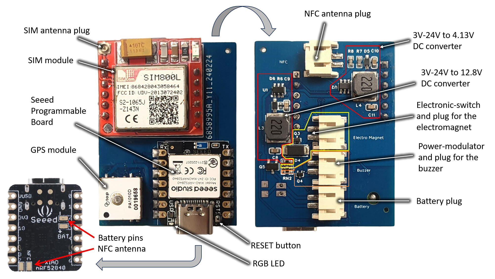
- The pluggable components :
  - **Battery** : a "LP603449" Lithium-Polymer battery ► 3.7V ► 1100mAh ► 4.3Wh (2 pins plug)
  - **Electromagnetic lock** : a 12V/500mA DC electromagnetic lock (2 pins plug)
  - **Buzzer** : a 3V-24V DC piezzo-electric buzzer (2 pins plug)
  - **NFC[^7] antenna**: a "Molex 1462360031" NFC[^7] antenna directly plugged into the main board for NFC[^7] communication. (2 pins plug)
  - **2G antenna**: pluggable on the SIM[^11] module (2 pins plug)
  - **SIM[^11] card**: a 2G nano-SIM[^11] in its micro-SIM[^11] adapter, pluggable in the SIM[^11] holder 
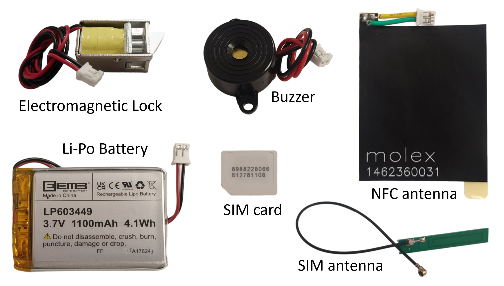

## Software

This project uses C/C++ through the Arduino® IDE[^4], to develop the firmware[^3] of the Seeed board.  
The company gave us their first version of the software they coded ([here to download](data/arduino-code-05-03.zip)), which includes all the features exposed in the [Functional Specifications](https://github.com/algosup/2023-2024-project-4-sportshield-team-5/blob/main/documents/functional-specification/functional-specification.md).

The usage of public libraries is allowed.

## Resources

For the Hardware, we received some documentation about the components and also the old schematics of the electronic circuit :

### Documentation about components
- [*Xiao NRF52840 sense* electronic architecture](data/Seeed-Studio-XIAO-nRF52840-Sense-v1.1.pdf) *(provided by the company)*
- [NRF52840 microcontroller datasheet](data/nRF52840-PS-v1.5.pdf)
- [GPS module datasheet](data/CD-PA1010D-datasheet-v.02.pdf) *(provided by the company)*
- [SIM[^11] module datasheet](data/SIM800L-SIMCom.pdf) *(provided by the company)*
- [Li-Po Battery datasheet](data/batterie-LP603449.pdf) *(provided by the company)*

![gps, SIM[^11], and seeed pinout](data/main-components-pinout.png)
### Electronic circuit diagrams
The power management of the board follows this diagram :
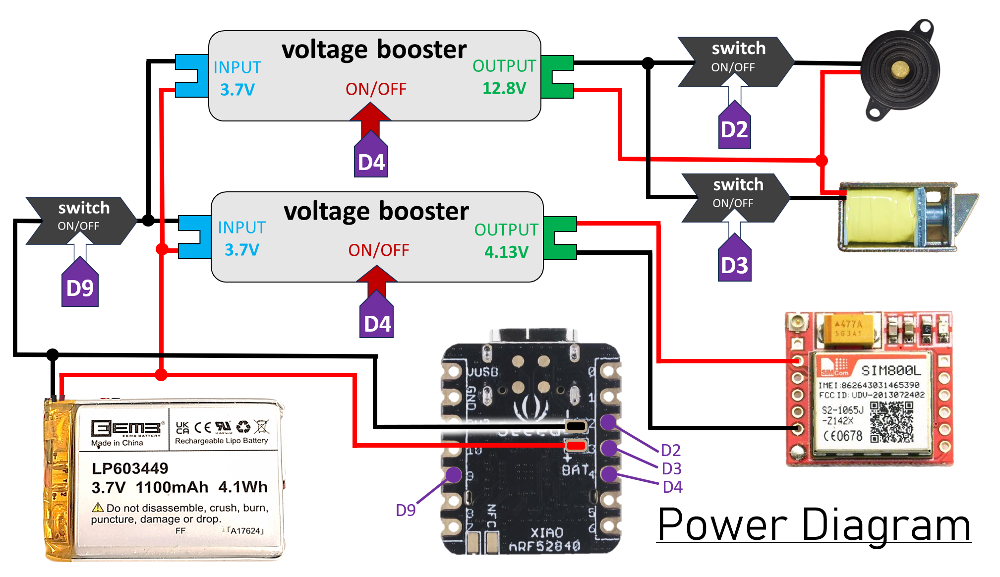
You can find the connections for the Seeed Board, the SIM[^11] module and the GPS module in the following document:
![SIM[^11], GPS, and Seeed board connections](data/easyEDA-connections.png)([easyEDA[^14] sketch here](data/easyEDA-connections.json))  

To dive into the electronic circuits of the PCB, there is the [PCB circuit schematic](data/SportShield-Electronics-diagram.png) provided by the company. However, this schematic is not up to date. The most important point is the absence of the Q5 MOSFET. This component is principally used to cut power supply to other components using the control pin D9.

# 3. Set-up the environnement

This is a tutorial of how to upload in the hardware, the code we had been given:  

## 1. Download and install the Arduino® IDE 
Download the executable according to the OS[^15] from [the official website](https://www.arduino.cc/en/software).

## 2. Add the board to Arduino®
Open the software and click on 'File'->'Preferences' . Then, copy-paste this URL : "https://files.seeedstudio.com/arduino/package_seeeduino_boards_index.json" in the last blank section of the window. Then, click 'OK':
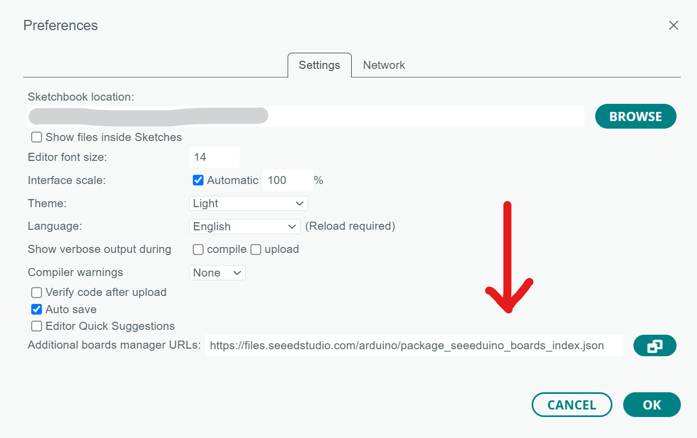  
Now, open the board manager and install the "Seeed NRF52 mbed-enabled Boards" driver:  
   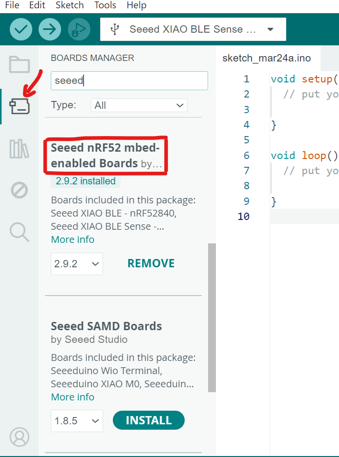   
   
## 3. Add the libraries
Open the library manager[^5] (button which is just under the board manager one) and install at least these ones by searching them:
   - NRF52_MBED_TimerInterrupt *V1.4.1*
   - ArduinoBLE *V1.3.6*
   - Adafruit GPS Library *V1.7.4 (installall)*
   - Sim800L http connector *V1.14.0*
   - Seeed Arduino[^1] LSM6DS3 *V2.0.3*
   - OneWire *V2.3.7*
  
## 4. Open the current code
Download [here](data/arduino-code-05-03.zip) the given code, and after unzipping it, open "SS_05-03_anglais-batterycontrol.ino" 
   
## 5. Connect the board
Just connect the Seeed board with a USB-C cable. And to have a concrete result, plug all the 6 components (shown above).

## 6. Select the board and the port

On the IDE[^4], there are some buttons on the top organized as follows:  
  
- The first button is used to compile code.
- The second button is used to upload code to the board.
- The third one is used to debug code.
- The dropdown is used to select the board and the right USB port.

So now, click on the dropdown, and then, on 'Select other...'  
  

Now this page is opened, search for the Seeed BLE nrf52840 sense board, and click on the name.  
On the right, appears the list of the available USB ports to upload to. Click on the one corresponding to the board. Often, there is only one, but, unplug/replug the board to see which one it is.  
Then click 'OK'  
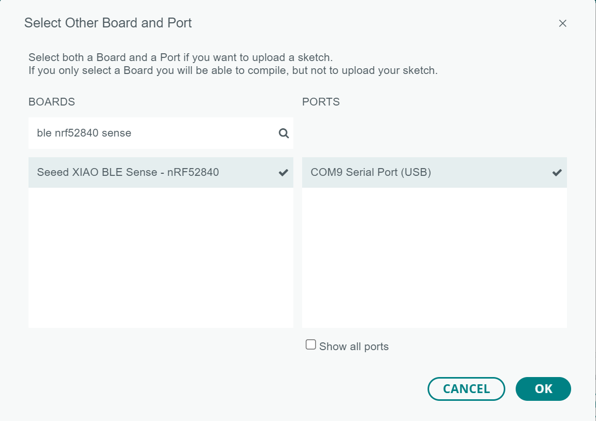    

## 7. Upload code

Just click on the 'upload' button we saw previously. It will compile, then upload the code.

## 8. Troubleshoot

If no problem was encountered during the whole process, skip this point.

First and foremost, simply press the 'reset' button on the card (Cf. pinout above) and try to upload again.

If the code is still not uploading, try first to run a simple code on the board : for that, click on 'File'->'Examples'->'01.Basics'->'Blink' and try to upload again. This code should make an LED blink on the board. If not, maybe the wrong port is selected.

We won't expand on all the possible causes of a failure, so we encourage to read again attentively these 7 steps, and check if it worked well. If there are still some problems, find some help on the internet, by copying the error message of the terminal output. And if possible, try with another board.

# 4. Methodology and Conventions

## GitHub

### Branches

The **main branch** hosts only files which are finished and reviewed by the Quality Assurance. This branch requires a 'pull request[^10]' reviewed by at least 1 other member of the team before a merge. It can't be bypassed by anybody.

The **document branch** hosts the document being redacted and doesn't follow any particular rule.

The **dev branch** hosts the software we are coding, but requires the code inside to don't have any compilation errors, and, if possible, to work as expected at th current step.
This branch requires a 'pull request[^10]' reviewed by at least 1 other member of the team before a merge.

### Files and folders architecture

Each folder and file name will be in ```kebab-case```, except for the files used as illustrations or resources in the main documents of the project. Also, the folder and its .ino file where is contained the firmware[^3] will follow the ```snake_case```.
```
Root/
├── src/
│   └── sport_shield_team_5/
│       ├── sport_shield_team_5.ino
│       ├── definition.h
│       ├── bluetooth.h
│       ├── detection.h
│       ├── alarm.h
│       ├── power.h
│       ├── lock.h
│       ├── sim.h
│       ├── gps.h
│       └── nfc.h
├── documents/
│   ├── functional-specification/
│   │   ├── functional-specification.md
│   │   └── data/
│   │       └── ...
│   ├── technical-specification/
│   │   ├── technical-specification.md
│   │   └── data/
│   │       └── ...
│   ├── quality-assurance/
│   │   ├── test-plan.md
│   │   ├── data/
│   │   └── ...
│   ├── management/
│   │   ├── weekly-reports/
│   │   ├── project-charter.md
│   │   ├── data/
│   │   │   └── ...
│   │   └── ...
│   ├── user-manual/
│   │   └── user-manual.pdf
│   └── firmware_updates.md
├── README.md
├── LICENSE.md
└── .github
```
## Code

### Instructions

#### Appearence

The variables' names are in ```snake_case```.
The functions' names are in ```camelCase```.
The definitions' names are in ```COBOL_CASE```.

The indentation of 2 spaces is added after each carriage return in after a curly bracket.

When a condition or a loop occurs, the curly brackets are opened at the end of the first line of the statement, and closed in a single-last line without the indentation.

However some simple statements can be written in one line, as long as it doesn't take more than 50 characters approximately.

#### Variables

**No value can be hard-coded !**

If a number or a constant is needed in the code, it have to be defined in the 'definitions.h' header and not directly inserted in the algorithm itself, even if "it shouldn't change".

In the same idea, variables' declaration and first assignment should be separated : the declaration in 'definition.h. An example of this appears in the example below.

#### Comments

Each function need a comment above explaining its behavior and how parameters are used.  
Any weird or tricky algorithm has to be commented.  
Any variable declaration need a comment on the same line to quickly explain what it is. If it is too obvious, just write ```// explicit```.

### Example of a good code*

```cpp
#define BUZZER D2
#define LONG_ALARM_REPETITIONS 5
#define LONG_ALARM_PERIOD 350

int current_period; // duration of silence at the end of the alarm loop

// Generic arduino function containing the code executed after a RESET
void setup(){
  pinMode(BUZZER, OUTPUT);
  current_period = LONG_ALARM_PERIOD;
}

void loop(){
  while (current_period>=0){
    longAlarm(current_period);
    current_period--;
  }
}

// Make the buzzer ringing 5 times : (period)ms ON / (period)ms OFF
void longAlarm(int period){
  for (int i=0; i<LONG_ALARM_REPETITIONS; i++){
    digitalWrite(BUZZER, HIGH);
    delay(period);
    digitalWrite(BUZZER, LOW);
    if (i>0){delay(period);} //skip the last silence
  }
}
```
**Of course this code doesn't make sense, it is just an example.*

# 5. Software's technical specifications

## Overview

Each of the following parts will explain the technical implementation, following the structure of the 'Functional Requirements' part of the [Functional specification](https://github.com/algosup/2023-2024-project-4-sportshield-team-5/blob/main/documents/functional-specification/functional-specification.md) document.  

We don't have access to the application, the server with which the SIM[^11] card communicates or the final hardware. And we are not supposed to use our smartphones to test the NFC[^7] or the bluetooth.  
That's why the company has explicitly suggested that we only **simulate** the complex interactions with the hardware, such as Bluetooth communication or sending data over the 2G network[^12] (soon to be obsolete), by using forced values such as "bluetooth_unlock = 1 or 0 : the user has pressed the button on the application or not".   
The company's request is really to improve the software by finding an effective algorithm, and not to write assembly to make components working. (It is the reason why we only had 4.5 weeks to work on, while it is usually 6 or 7.)
We will therefore focus on technical detail only on the points where we can take action. These are:  
- battery management and energy consumption (sleep mode, power cut, ...)
- multi tasks to make the buzzer ringing and to send the notification at the same time, while also being able to stop the alarm at any moment.
- take the NFC[^7] into account
- movement detection (improve the way to detect a theft)

## Headers and defintition.h

In this file there are :
- Inclusion of all the public libraries used in the firmware[^3].
- Definition of all the constant values, used in the different headers
- Definition of all the structures, classes, global functions, and so on

The advantage would be to have all the "settings" of the entire firmware[^3] in one file. In this way, we can make some changes about values extremely easily.

Each header file will include the necessary public libraries a second time if it is needed. However, the use of a conditional inclusion is required to avoid multiple inclusions of the same library.

## The main file (.ino)

In this file there are :
- **inclusion** of the different **headers** (and not the libraries -> 'definition.h')
- the '**void setup()**' where are executed only functions.  
  this function contains the code which will be executed once at the beginning after a reload of the program on the board (after a power-up or reset)
- the '**void loop()**'
  this function has the role of a 'while(true)' loop : it is the main loop

Base of the .ino file :  
  ```cpp
#include"definition.h"
#include"bluetooth.h"
#include"detection.h"
#include"alarm.h"
#include"power.h"
#include"lock.h"
#include"sim.h"
#include"gps.h"
#include"nfc.h"

void setup(){
  //code executed once at the beginning
  //only functions
}

void loop(){
  //main loop
}
  ```

## Algorithm

We don't need to forecast what is in the 'void setup()' function. This is just all the initializations of the different components and libraries, and the setting of what is the initial state of the device.

Now, the algorithm itself, the main loop of the firmware[^3], is available in this diagram (please forgive the size !) :

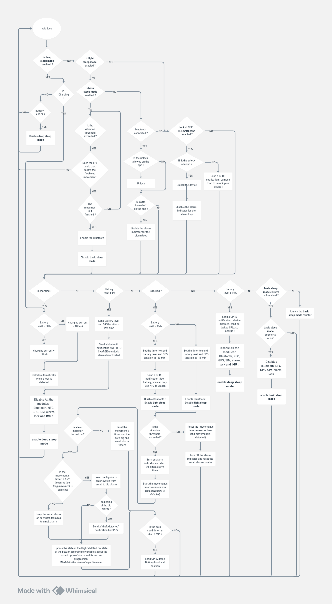

It allows :
- the battery consumption's management
- execute parallel tasks when a theft is detected
- to take advantage of the NFC[^7]

## Power Management

#### specifications

The device will have different behaviors of power consumption according to 3 parameters : 
- the lock state of the SportShield
- the level of battery (or charging the battery)
- the period of inactivity.

If the battery level is ABOVE 15%, NFC[^7] only is enabled because NFC[^7] consume like 5mA while Bluetooth Low Energy (BLE) consumes 15mA (3 times more).

By default the buzzer, the electromagnetic lock and SIM[^11] module circuit are disabled by turning D9 and D4 'LOW' (Cf. [power management diagram](#electronic-circuit-diagrams)).  
If only one of these components are required, we turn on both D4 and D9, and a variable have to keep track of the number of devices currently used. If there is any, D9 and D4 are turned OFF to save as much energy as possible.

Each time we need to get the GPS position we first have to enable the wake up pin of the GPS module : D8, and then turned it off again.

#### implementation

Also, the percentage of the battery and the management of its charge will require a specific public library called...  

A key feature of the battery management ids the ability to know the current capacity (%). There are 2 methods for that :
- The ideal one but over-consuming electricity is to measure constantly the voltage and the intensity which goes out from the battery to know how much energy had been used or had been loaded in real-time. However it is almost impossible to implement and this solution using though a 'colorimeter' is reserved for very particular usages.
- The very spread solution is to just measure the current voltage and to compare the value to a set of previous measures took to define the correlation between the current capacity and the current voltage.

And the library we use need some based values to be accurate due to the specificities of each battery.

Indeed, the battery voltage follows a generic curve which looks like that : 
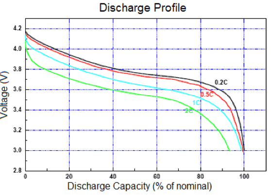
As we can see, the maximum voltage (charging voltage) is 4.2V and the voltage can drop down until 2.75V MAXIMUM before its cut-off according to the documentation provided.   
Also, the SportShield is a low-consumption device, and will follow a 0.015C discharge for basic sleep mode (The 'C' unit means that the discharge flux it about C times the full capacity of the battery per hour. In our case 0.1C corresponds to 1100mAh*0.015C = 16.5 mA[^16] of discharge).

Furthermore, as the temperature would be quite low, around 41°F to 23°F (as it is mainly for skis and snowboards), the discharge should avoid to exceed 80% of the total capacity. We finally get a minimum voltage (if the battery is in a cold environment) of 3.4V corresponding to a 0%. Also, we will used some standard curves of discharge to evaluate the current battery capacity based on the voltage we can get from the board itself (included function).

Knowing that, all these values and decisions are really subjective and need to be defined precisely after a bunch of tests with the final hardware, in the real conditions. That's why we'll put these values without considering more than the assumptions above, cause with our current hardware, any measurement could be accurate.

## Detection of a theft

When we received the project, the current idea was to split a detected movement into 3 categories : noise, small and big movements.

However, they admitted that a smooth and slow theft could stay undetected.
That's why we decided to just differentiate noise and movement, and to look at the duration of the movement more than the intensity. This way, a short shock, which can happens won't be detected as a theft while any movement lasting more than 1 second is detected as a theft, and in any case, any movement trigger a small alarm for 1 second, as a dissuasion. However the GPRS[^17] signal to get a notification on the app will be received only when an real theft is detected.

## Detection of the wake-up movement

A specific movement of a 180° back-and-forth rotation on the x axis is required to wake up the device.

Here are the different axis of the device : 
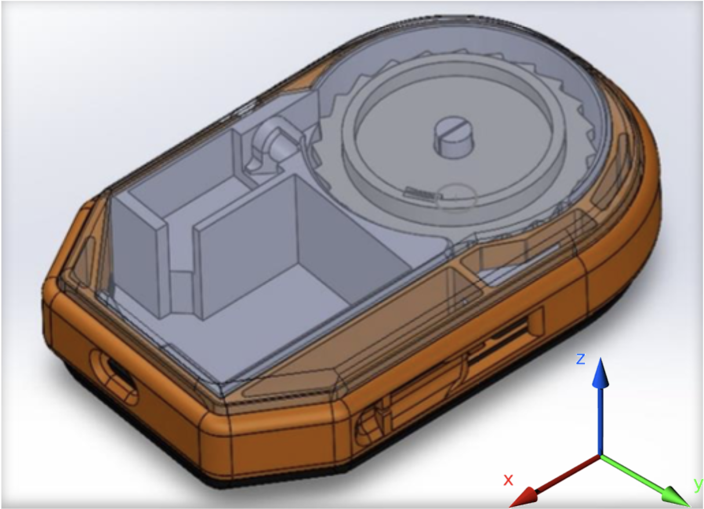 

How does work the specific movement detection, to wake up the device  ?

The movement detection follows this algorithm :   
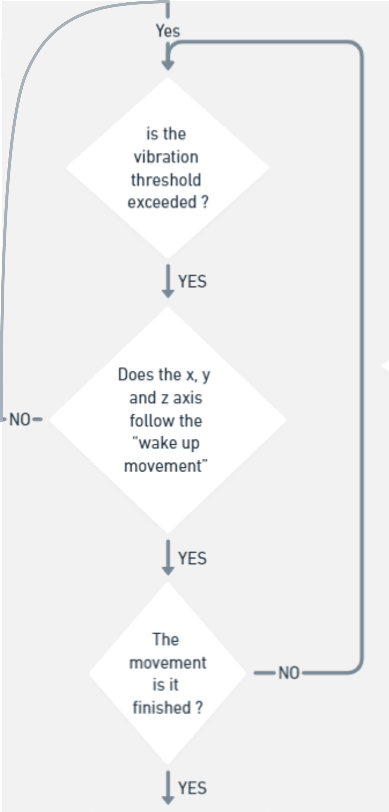 

Now, the way to find if the trajectory is not followed, is by capturing very regularly the rotation and the acceleration on each axis using the embedded IMU (Inertial Measurement Unit) of the main board.

Units of the IMU are in 'g' 1g = 9.81m/s2.

The trajectory is considered as valid if :
- A big positive rotation followed by a big negative rotation on the X axis is detected. Both need to have a ratio of intensity between 0.5 and 2.
- Any too big acceleration is detected on X axis.
- Any too big rotation is detected on both Z and Y axis.
- Z acceleration goes from -1 stable to 1 (180° rotation) to -1 stable (-180° rotation) because gravity is 1 g. 
- Y acceleration goes from 0 stable to 0 (180° rotation) to 0 stable (-180° rotation).

Y and Z acceleration illustration :   
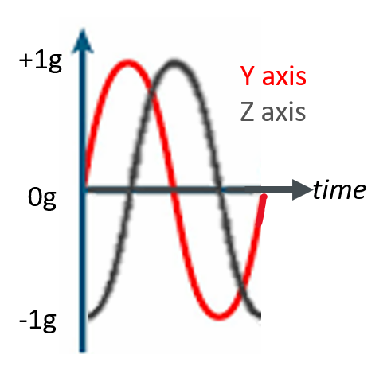  
We won't look at the sinusoidal aspect of the movement and but only look only at the peaks and their correlation in time.

## Alarm

As the buzzer is controlled by a MOSFET[^6], we decided to use PWM (Pulse Wave Modulation = a high frequency square wave, where the proportion of ON/OFF time in average can be set), to make the piezoelectric[^18] buzzer ring lower. A simple R-C circuit would have been better to smooth the output voltage to the buzzer, but as the MOSFET[^6] has a capacitance, even if the song is not the same we succeeded to get a lower noise from the buzzer.

## NFC

As the Seeed boards company released their Xiao-NRF52840 quite recently, we found on the official forum of the company website for documentation, that they said they still didn't ended to develop the NFC[^7] library of their board. The problem with this unfinished library, is that, as they have their own version of RFID microchip and circuit, embedded in the board, the only solution we found to try having it working, is by coding our own library directly in assembly. That's why we probably won't develop the concrete NFC[^7] functions more than simulating input and output through the terminal.


# 6. Suggestions (out of scope)

## Electro-Magnetic lock

## Power Button

# 7. Glossary

[^1]: Arduino: An open-source electronics platform based on easy-to-use hardware and software.

[^2]: DC Converter: A device that converts direct current (DC) from one voltage level to another.

[^3]: Firmware: Software that controls the functionality of electronic devices.

[^4]: IDE: Integrated Development Environment, a software application that provides comprehensive facilities to programmers for software development.

[^5]: Library Manager: A tool for managing libraries, collections of pre-written code, in programming environments.

[^6]: MOSFET: Metal-Oxide-Semiconductor Field-Effect Transistor, a type of transistor used for amplifying or switching electronic signals.

[^7]: NFC: Near Field Communication, a technology that enables communication between devices when they are brought close together.

[^8]: PCB: Printed Circuit Board, a board used to mechanically support and electrically connect electronic components.

[^9]: Programmable Board: A board that allows users to program and customize its functionality.

[^10]: Pull Request: A method of submitting contributions to a project on GitHub for review and inclusion.

[^11]: SIM: Subscriber Identity Module, a smart card inside a GSM cellular phone.

[^12]: 2G Network: Second Generation Network, a telecommunications network technology that provides improved data transmission speeds compared to its predecessor.

[^13]: Embedded System: A computer system designed to perform specific tasks.

[^14]: easyEDA: A free, web-based EDA (Electronic Design Automation) tool that allows for designing PCBs.

[^15]: OS: Operating System, software that manages computer hardware and software resources and provides common services for computer programs.

[^16]: mA: Milliampere, a unit of electrical current equal to one thousandth of an ampere.

[^17]: GPRS: General packet radio service

[^18]: Piezoelectric: The ability of certain materials to generate an electric charge in response to applied mechanical stress