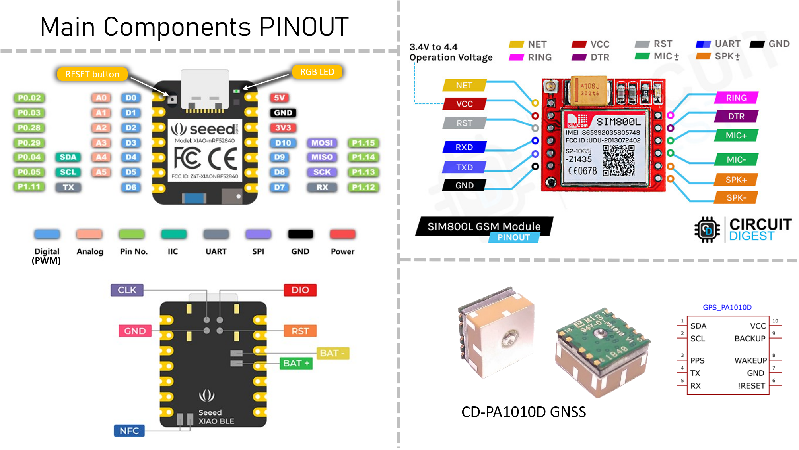

# Technical Specifications

Algosup - Team 5 - Project n°4 - Sport Shield


| Role | Name |
|---|---|
| Project Manager | Vivien TSONGUE |
| Program Manager | Arthur LEMOINE |
| Tech Lead | Benoît DE KEYN |
| Software Developer | Aurélien FERNANDEZ |
| Quality Assurance | Antoine PREVOST |
| Technical Writer | Clémentine CUREL |

<details>

<summary>

# Table of Content

</summary>

- [Technical Specifications](#technical-specifications)
- [Table of Content](#table-of-content)
- [Document Purpose \& Definition](#document-purpose--definition)
- [Glossary](#glossary)
- [1. Project Overview](#1-project-overview)
  - [Project Brief](#project-brief)
  - [Hardware](#hardware)
  - [Software](#software)
  - [Ressources](#ressources)
    - [Documentation about components](#documentation-about-components)
    - [Electronic circuit diagrams](#electronic-circuit-diagrams)
- [2. Set-up the environnement](#2-set-up-the-environnement)
      - [1. Download and install the Arduino® IDE](#1-download-and-install-the-arduino-ide)
      - [2. Add the board to Arduino®](#2-add-the-board-to-arduino)
      - [3. Add the libraries](#3-add-the-libraries)
      - [4. Open the current code](#4-open-the-current-code)
      - [5. Connect the board](#5-connect-the-board)
      - [6. Select the board and the port](#6-select-the-board-and-the-port)
      - [7. Upload code](#7-upload-code)
      - [8. Troubleshoot](#8-troubleshoot)
- [3. Methodology and Conventions](#3-methodology-and-conventions)
  - [GitHub](#github)
    - [Branches](#branches)
    - [Files and folders architecture](#files-and-folders-architecture)
  - [Code](#code)
    - [Instructions](#instructions)
    - [Example of a nice code\*](#example-of-a-nice-code)
- [4. Implementation technical specifications](#4-implementation-technical-specifications)
  - [Introduction](#introduction)
  - [The main loop (.ino)](#the-main-loop-ino)
  - ['definitions' header](#definitions-header)
  - ['bluetooth' header](#bluetooth-header)
  - ['detection' header](#detection-header)
  - ['alarm' header](#alarm-header)
  - ['power' header](#power-header)
  - ['lock' header](#lock-header)
  - ['sim' header](#sim-header)
  - ['gps' header](#gps-header)


</details>


# Document Purpose & Definition

The goal of the Technical Specifications is to take the Functional Requirements that define the features, scope, and goals of the project, dissect each requirement, and turn it into instructions, as clear as possible, to guide the development team as well as the quality assurance team in the successful completion of their mission.

We therefore encourage thorough reading of the [Functional Specifications](https://github.com/algosup/2023-2024-project-4-sportshield-team-5/blob/main/documents/functional-specification/functional-specification.md) before further reading.

The goal of the Technical Requirements is to clarify as many dark areas as possible to prevent the engineers from making decisions
In a sense, while the Functional Requirements represent the "What/Why" aspect of the project, the Technical Requirements are supposed to represent the "How" of the project.

With that being said, we will try to cover as many functional and non-functional aspects of the project while making technological and architectural decisions, evaluating those decisions, measuring their associated risks and impact (providing mitigation), and comparing those to other potential solutions.

The document should also benefit other stakeholders and project owners by giving insight into our methodology and may serve as a future reference for maintenance or simple documentation purposes.

# Glossary

# 1. Project Overview

## Project Brief

As fully explained in the [Functional Specifications](https://github.com/algosup/2023-2024-project-4-sportshield-team-5/blob/main/documents/functional-specification/functional-specification.md), our goal in this project is to improve the firmware of an embedded system called "Sport Shield". This "Sport Shield" is an anti-theft device intended only for snowboards and skis at present. It consists of a box equipped with a set of electronic and mechanical equipment, containing a steel cable to be wrapped around the object to be secured.

How does this Sport Shield work?

When the cable is wrapped and the box is in a locked state, the device is looking for any physical disturbances. If any movement or vibration of the box is detected as a possible theft, it turns on a strong alarm, more or less loud according to the level of disturbance (intensity and duration of the movement). At the same time, it sends a warning notification to the owner by a dedicated smartphone application, using the internet network.
To stop the alarm or unlock the shield, the owner uses the application and it processes via Bluetooth or NFC.
Also, during the locked period, the device will send regularly the GPS position and battery level by the 2G network, to a remote server communicating with the app.
The aim is to make the sports shield as rustic and resilient as possible, minimizing direct user interactions with the hardware and keeping them remote, via the Bluetooth app.

The company who gave us this project, explained all of it during a presentation at the very beginning. Here is the [PDF of the presentation](files/SportShield-project-Brief-AlgoSup-Embedded-software-optimization.pdf).

## Hardware

This project is not about the entire conception of the device from scratch. To be able to develop the firmware of the device we needed only the electronic and informatic parts of the project being developed. Thus, we received :

- the electronic card (which gathers and links by soldered circuits all the micro-electronic) of the embedded system, which includes :
  - **A programmable board**: a "Seeed Xiao BLE nRF52840 Sense" (more details below)
  - **SIM card holder**: a "SIM800L GSM/GPRS 2G" version "S2-1065J-Z143N"
  - **GPS module**: a "CD-PA1010D GNSS patch antenna module"
  - **12V DC converter** : Based on a MT3608 DC-DC converter microship, the circuit provides exactly 12.7V (the MT3608 handles "2V-24V ➔ 3V-28V" with 2A).
  - **4V DC converter** : Based on the same MT3608 as above, this circuit provides exactly 4.13V.
  - 3x **electronic-switch** circuits : basically, it is just a MOSFET transistor. Two are a "DMG1012t" and the last is not referenced.
  - 4x **2 pins plugs**: to connect the external components  

- the pluggable components :
  - **battery** : a "LP603449" Lithium-Polymer battery ► 3.7V ► 1100mAh ► 4.3Wh (2 pins plug)
  - **electromagnetic lock** : a 12V/500mA DC electromagnetic lock (2 pins plug)
  - **buzzer** : a 3V-24V DC piezzo-electric buzzer (2 pins plug)
  - **NFC antenna** : a "Molex 1462360031" NFC antenna directly plugged on the main board for NFC communication. (2 pins plug)
  - **2G antenna** : pluggable on the SIM module (2 pins plug)
  - **SIM card** : a 2G nano-SIM in its micro-SIM adaptator, pluggable in the SIM holder  


## Software

This project uses C/C++ through the Arduino® IDE, to develop the firmware of the Seeed board.  
The company gave us their first version of the software they coded ([here to download](files/arduino-code-05-03.zip)), which includes all the features explained in [their presentation](files/SportShield-project-Brief-AlgoSup-Embedded-software-optimization.pdf), and in the [Functional Specifications](https://github.com/algosup/2023-2024-project-4-sportshield-team-5/blob/main/documents/functional-specification/functional-specification.md).

The usage of public libraries is allowed.

## Ressources

For the Hardware, we received some documentation about the components and also the old schematics of the electronic circuit :

### Documentation about components
- [*Xiao NRF52840 sense* electronic architechture](files/Seeed-Studio-XIAO-nRF52840-Sense-v1.1.pdf) *(provided by the company)*
- [NRF52840 microcontroller datasheet](files/nRF52840-PS-v1.5.pdf)
- [GPS module datasheet](files/CD-PA1010D-datasheet-v.02.pdf) *(provided by the company)*
- [SIM module datasheet](files/SIM800L-SIMCom.pdf) *(provided by the company)*
- [Li-Po Battery datasheet](files/batterie-LP603449.pdf) *(provided by the company)*


### Electronic circuit diagrams
The power management of the board follows this diagram :

Here, the connectics for the Seeed Board, the SIM module and the GPS module :
([easyEDA sketch here](files/easyEDA-connectics.json))  

If you want to dive into the electronic circuits of the PCB, there is the [PCB circuit schematic](files/SportShield-Electronics-diagram.png) provided by the company. However, this scematic is not up to date. The most important is the absence of the Q5 MOSFET used to cut the battery to other components using the control pin D9.

# 2. Set-up the environnement

In order to improve the software of the device, you need to:

#### 1. Download and install the Arduino® IDE 
You can download the executable for your OS, from [the official website](https://www.arduino.cc/en/software).

#### 2. Add the board to Arduino®
Open the software and click on 'File'->'Preferences' . Then, copy-paste this URL : "https://files.seeedstudio.com/arduino/package_seeeduino_boards_index.json" in the last blank section of the window. Then, click 'OK':

Now, open the board manager and install the "Seeed NRF52 mbed-enabled Boards" driver:  
   
   
#### 3. Add the libraries
Open the library manager (button which is just under the board manager one) and intall at least these ones by searching them:
   - NRF52_MBED_TimerInterrupt *V1.4.1*
   - ArduinoBLE *V1.3.6*
   - Adafruit GPS Library *V1.7.4 (instal all)*
   - Sim800L http connector *V1.14.0*
   - Seeed Arduino LSM6DS3 *V2.0.3*
   - OneWire *V2.3.7*
  
#### 4. Open the current code
Download [here](files/arduino-code-05-03.zip) the given code, and after unzipping it, open "SS_05-03_anglais-batterycontrol.ino" 
   
#### 5. Connect the board
Just connect the Seeed board with a USB-C cable. And to have a concrete result, plug all the 6 components (shown above).

#### 6. Select the board and the port

On your IDE, ypu have a bar on the top like that :  
  
- The first button is to compile code.
- The second button is to upload code to the board.
- The third one is to debug code.
- The bar is to select the board and the right USB port.

So now, click on the bar, and then, on 'Select other...'  
  

Now you have this page opened, search for the Seeed BLE nrf52840 sense board, and click on the name.  
On the right, appears the list of the available USB ports to upload to. Click on the one corresponding to your board. Often, there is only one, but, unplug/replug your board to see which one it is.  
Then click 'OK'  
  

#### 7. Upload code

Just click on the 'upload' button we saw previously. It will compile, then upload your code.

#### 8. Troubleshoot

If you did not encouter any problem, you can skip this point.

Before anymore solution, you can simply press the 'reset' button on your card (Cf. pinout above) and try to upload again.

If your code is still not uploading, try first to run an simple code on your board : for that, click on 'File'->'Examples'->'01.Basics'->'Blink' and try to upload again. This code should make a LED blinking on your board. If not, maybe you selected the wrong port.

I won't develop all the possible causes of a fail, so I encourage you to read again attentively these 7 steps, and check if it worked well. If you are still having problems, find some help on internet, by copying the error message of the terminal ouput. And if you can, try with another board.

# 3. Methodology and Conventions

## GitHub

### Branches

The **main branch** hosts only files which are finished and reviewed by the Quality Assurance. This branch requires a 'pull request' reviewed by at least 1 other member of the team before a merge. It can't be bypassed by anybody.

The **document branch** hosts the document being redacted and doesn't follow any particular rule.

The **dev branch** hosts the software we are coding, but requires the code inside to don't have any compilation errors, and, if possible, to work as expected at th current step.
This branch requires a 'pull request' reviewed by at least 1 other member of the team before a merge.

### Files and folders architecture

Each folders' and files' name will be in ```kebab-case```, except for the files used as illustration or ressources in the main documents of the project. Also, the folder and its .ino file where is contained the firmware will follow the ```snake_case```.
```
Root/
├── src/
│   └── sport_shield_team_5/
│       ├── sport_shield_team_5.ino
│       ├── definition.h
│       ├── bluetooth.h
│       ├── detection.h
│       ├── alarm.h
│       ├── power.h
│       ├── lock.h
│       ├── sim.h
│       ├── gps.h
│       └── nfc.h
├── documents/
│   ├── functionnal-specification/
│   │   ├── functionnal-specification.md
│   │   └── data/
│   │       └── ...
│   ├── technical-specification/
│   │   ├── technical-specification.md
│   │   └── data/
│   │       └── ...
│   ├── quality-assurance/
│   │   ├── test-plan.md
│   │   └── test-files/
│   │       └── ...
│   ├── management/
│   │   ├── weekly-reports/
│   │   ├── project-charter.md
│   │   ├── data/
│   │   │   └── ...
│   │   └── ...
│   ├── user-manual/
│   │   ├── user-manual.pdf
│   │   ├── user-manual.md
│   │   └── data/
│   │       └── ...
│   └── firmware_updates.md
├── README.md
├── LICENSE.md
└── .github
```
## Code

### Instructions

The identation of 2 spaces is added after each carriage return in after a curly bracket.

When a condition or a loop occurs, the curly brackets are opened at the end of the first line of the statement, and closed in a single-last line without the identation.

However some simple statements can be written in one line, as long as it doesn't take more than 50 characters aproximately.

The variables' names are in ```snake_case```.
The functions' names are in ```camelCase```.
The definitions' names are in ```COBOL_CASE```.

Each constant value accross the code need to be defined with '#define' in the 'definitions.h' header file.

**No value can be hard-coded\* !**

**if a number appears in your code, it have to be defined in the 'definitions.h' header and not directly inserted in the algorithm itself, even if "it shouldn't change" !, and even at the variables' assignement. (Cf. example below)*

Each function has to be written in the suitable header.h  
Each function need a comment above explaining its behavior and how parameters are used.  
Any weird or touchy algorithm you made has to be commented.  
Any 

### Example of a nice code*

```
#define BUZZER D2
#define LONG_ALARM_REPETITIONS 5
#define LONG_ALARM_PERIOD 350

int current_period; // duration of silence at the end of the alarm loop

// Generic arduino function containing the code executed after a RESET
void setup(){
  pinMode(BUZZER, OUTPUT);
}

void loop(){
  current_period = LONG_ALARM_PERIOD;
  while (current_period>=0){
    longAlarm(current_period);
    current_period--;
  }
}

// Make the buzzer ringing 5 times : (period)ms ON / (period)ms OFF
void longAlarm(int period){
  for (int i=0; i<LONG_ALARM_REPETITIONS; i++){
    digitalWrite(BUZZER, HIGH);
    delay(period);
    digitalWrite(BUZZER, LOW);
    if (i>0){delay(period);} //skip the last silence
  }
}
```
**Of course this code doesn't make sense, it is just an example.*

# 4. Implementation technical specifications

## Introduction

Each one of the following parts will explain the technical implementation following the structure of the very complete 'Functionnal Requirements' part of the Functionnal specification I invite you to read before a last time.
Now I will avoid any redundance with this document.
We will first details the main loop algorithm, and then, the implementation properties of each component.
We will clarify the expected content of each of the 9 individual files (cf. above) that make up our complete code.

## The main loop (.ino)

## 'definitions' header

## 'bluetooth' header

## 'detection' header

## 'alarm' header

## 'power' header

## 'lock' header

## 'sim' header

## 'gps' header


